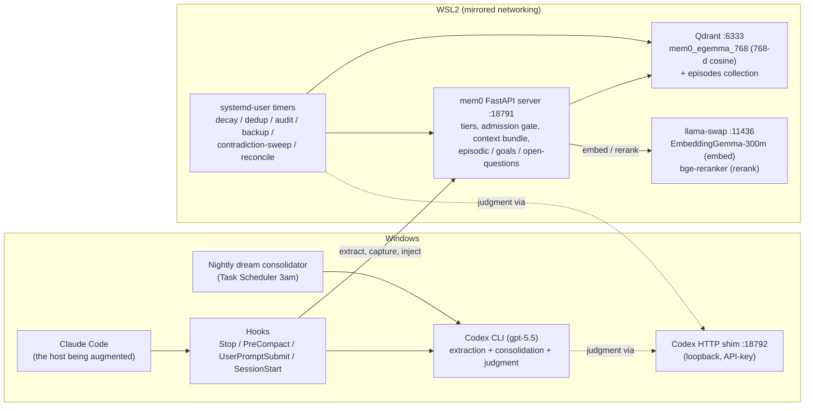
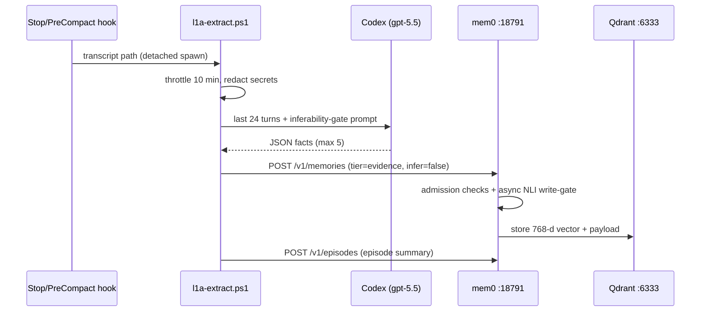
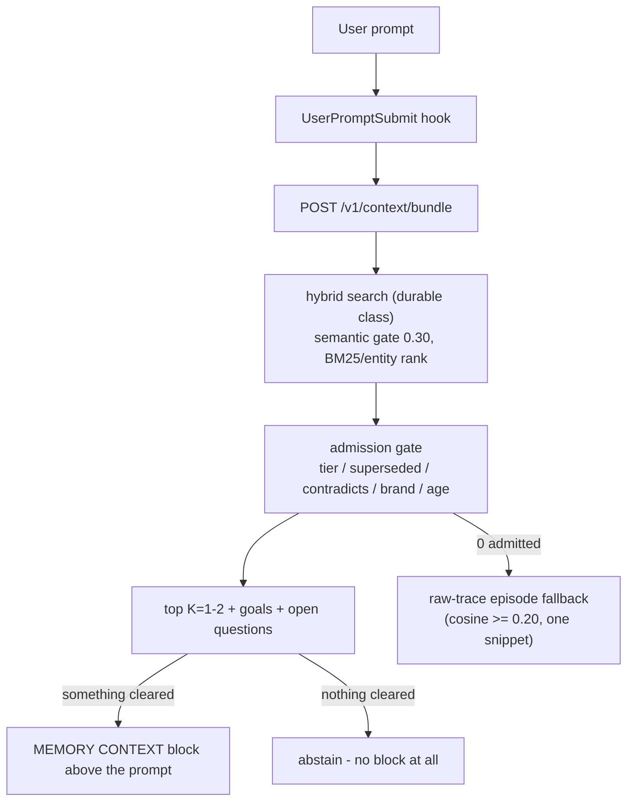

# Architecture

A persistent, multi-tier, **measurably faithful** memory backend for Claude Code on Windows + WSL2. This document explains how the whole system works: the six functional layers, the trust-tier memory model, the life of a memory from conversation to retrieval, and the safety invariants that keep a *self-writing* store honest.

> **How to read this doc.** Skim the [bird's-eye view](#birds-eye-view) and the [six layers](#the-six-functional-layers) for the mental model; use the [component code map](#component-code-map) and [ports table](#processes--ports) as reference while reading code. Per-component deep-dives live in [`docs/modular/`](./docs/modular/); day-2 operations in [`docs/operations.md`](./docs/operations.md); the API surface in [`docs/api-contracts.md`](./docs/api-contracts.md); the full doc map in [`docs/README.md`](./docs/README.md).

**Current shape** (see the `VERSION` file for the release): 4 long-running processes (mem0 FastAPI server, Qdrant, llama-swap, plus on-demand Codex CLI), ~10 Claude Code hooks, 2 Windows scheduled tasks, 6+ WSL systemd-user timers.

---

## Bird's-eye view

Everything is **loopback-only** and **API-key-gated** (`X-API-Key`, key file `~/.mem0/api-key`, mode 600). The only cloud dependency is the Codex CLI (ChatGPT OAuth), used strictly as the *LLM for extraction, consolidation, and judgment* — never as a data store.

---

## The six functional layers

Think of a fact's life: **born → stored → trusted → recalled → kept honest → maintained.**

| # | Layer | Job | Key code |
|---|---|---|---|
| 1 | [Capture (write path)](#1-capture--the-write-path) | Turn conversations into durable facts + episodes, automatically | `scripts/windows/l1a-extract.ps1`, `scripts/windows/dream-consolidate.ps1`, `mem0-server/episodic.py` — deep-dive: [`docs/modular/capture-pipeline.md`](./docs/modular/capture-pipeline.md) |
| 2 | [Storage + hybrid search](#2-storage--hybrid-search) | Persist facts as vectors; find them by meaning + keywords + entities | `mem0-server/app.py`, `mem0-server/config.py`, `mem0-server/egemma_embedder.py` |
| 3 | [Tiers + admission gate](#3-trust-tiers--the-admission-gate) | Rank by trust; hide superseded/contradicted/wrong-brand records at read time | `mem0-server/admission_gate.py`, `mem0-server/freshness.py` |
| 4 | [Recall (read path)](#4-recall--the-read-path) | Put the right 1–2 memories into the agent's context — or abstain | `scripts/windows/user-prompt-extract.ps1`, `scripts/wsl/mem0-mcp-shim.py`, `claude-config/sessionstart_bundle.py` — deep-dive: [`docs/modular/retrieval-pipeline.md`](./docs/modular/retrieval-pipeline.md) |
| 5 | [Reconciliation + governance](#5-reconciliation--governance) | Detect and resolve stale/contradicting facts — safely, human-gated | `scripts/wsl/contradiction-sweep.py`, `mem0-server/nli_write_gate.py`, `mem0-server/codex_shim_client.py` — deep-dive: [`docs/modular/reconciliation.md`](./docs/modular/reconciliation.md) |
| 6 | [Ops, security + tools](#6-ops-security--the-tool-surface) | Scheduled hygiene, crypto-gated canonical writes, backups, the MCP tool surface | `scripts/wsl/` maintenance jobs, `mem0-server/security_invariants.py`, `scripts/wsl/mem0-mcp-shim.py` |

### 1. Capture — the write path

Facts are extracted **automatically, with zero user action**, at four moments:

- **Session end / compaction** (`Stop` / `PreCompact` hooks → `stop-extract.ps1` → detached `l1a-extract.ps1`): a Codex subagent reads the last ~24 turns (12 KB cap) under a strict-JSON prompt whose top rule is an **inferability gate** — keep only genuinely project-specific facts a competent outsider could *not* guess (max 5/run, one successful extraction per 10 min). Credential shapes are redacted (`redact.py` server-side + `Redact-Secrets` in the readers) *before* text reaches the LLM or the store.
- **Per prompt** (`UserPromptSubmit` → compiled `mem0-hook-client.exe` → daemon): checkpoints an in-progress **episode** and captures **operator corrections** in real time (`~/.mem0/learn-rules.jsonl`) the moment they happen — no dependence on the nightly run.
- **Nightly at 3am** (Task Scheduler → `dream-consolidate.ps1`): the 4-phase "dream" (orient → gather → consolidate → prune) surprise-weights the last 36 h, synthesizes 1–3 lineage-tracked **insights**, and may autonomously promote at most **3 facts/night** to canonical through the enforced 4C contradiction/corroboration gate. A SessionStart **catch-up** spawner (`dream-catchup.ps1`) re-runs a missed dream (>48 h gap or pending queues); the MEMORY.md index refresh is decoupled so a down dream can't freeze it.
- **Write-time classification**: evergreen atomic facts become durable records (`tier=evidence`); volatile ship-log narratives fold into the **episode summary** (SQLite + FTS5 ledger `~/.mem0/episodic.db`) instead of polluting durable memory. Oversize writes are rejected at the API — atomicity is enforced at write time.

Failed writes dead-letter to a retry queue (poison-code quarantine, max 5 attempts). Every tier change and deletion appends to the **append-only tier ledger** (monthly segments `~/.mem0/tier-ledger-YYYY-MM.jsonl`).

### 2. Storage + hybrid search

- **Store**: Qdrant (systemd-user, loopback :6333), collection `mem0_egemma_768` — 768-d cosine, on-disk. A second collection holds **episode-summary embeddings** for the raw-trace fallback.
- **Embedder**: **EmbeddingGemma-300m** on llama-swap (:11436, CPU). Multilingual — EN/ES recall@1 ≈ 0.90 both (see [design decisions](#design-decisions-worth-knowing)). It requires *asymmetric task prefixes* (query vs document), applied by the prefix-shim `egemma_embedder.py` installed onto the mem0 embedding model at server start.
- **Server**: a FastAPI wrapper around mem0 2.x (loopback :18791) that owns the tier protocol, admission gate, context bundle, and the episodic/goals/open-questions sidecar. `/health` and `/health/deep` report the stack version and end-to-end store/embedder health.
- **Search is hybrid**: dense cosine is the **gate** (a candidate must clear the semantic threshold), then BM25 keyword + entity boosts shape the returned ranking. The gate is calibrated on the *raw semantic* scale — off-domain tops out ≈0.12, relevant runs 0.25–0.57, so the **0.30 gate** rejects noise with margin. (Raising it was measured to crater recall; calibration record in `eval/injection-gating/`, private repo.)
- **Reranker**: a bge cross-encoder applied only where its ~2 s CPU cost is acceptable — deliberate `memory_search` calls (auto-on at `limit ≥ 5`) — never on the hot per-prompt path.

### 3. Trust tiers + the admission gate

Every record carries a **tier** — the system's trust axis (full treatment, incl. lifecycles + query classes + the memory-type axis: [`docs/modular/memory-model.md`](./docs/modular/memory-model.md)):

| Tier | Meaning | Written by | Decays? |
|---|---|---|---|
| `canonical` | Locked ground truth | HMAC-signed CLI / dream auto-promote (≤3/night, gated) — **never** via plain `add` | No |
| `stable` | Durable settled facts | promotion | No |
| `insight` | Nightly-consolidated higher-order learnings | dream consolidator only | No |
| `evidence` | Default for auto-captured facts | extractor / MCP `memory_add` | Yes — Weibull, ~365-day half-life on the durable path (env-gated) |
| `temporal` | Explicitly time-bound facts | extractor / MCP | Yes — expiry + operational recency decay (~30-day half-life) |

`ADD_ALLOWED_TIERS = {evidence, temporal}` (plus `insight` for the consolidator actor); `canonical` writes require an HMAC token — see [security](#6-ops-security--the-tool-surface).

At **read time** every hit passes the **admission gate** (`admission_gate.py`) for its query class (`durable` / `operational` / `canonical` / `history`):

- hidden if **superseded** (`superseded_by`) or **contradicting canonical** (`contradicts_canonical`) — except in the forensic `history` class, which keeps everything reachable;
- hidden on **brand/workspace mismatch** — isolation is *fail-closed*: a brandless search returns only brand-neutral records; a branded search never leaks another brand;
- `operational` additionally enforces a recency cap; rejections log to `~/.mem0/admission-rejected.jsonl` for observability;
- the **local-judge advisory flag** (`contradicts_canonical_pending`) is *deliberately not enforced* — only an authoritative Codex verdict hides a record.

**Freshness** is tier-scoped Weibull decay (`freshness.py`): `w = exp(−ln2 · (age/η)^κ)`. The operational read path decays all results by age; the durable path decays only `evidence` (`DURABLE_DECAY_TIERS`). Canonical/stable/insight never decay — atemporal knowledge shouldn't age out.

### 4. Recall — the read path

Four delivery channels, all precision-first:

1. **Per-prompt injection** (`UserPromptSubmit` → one `POST /v1/context/bundle` round-trip): the top **K = 2** (frontier models) / **K = 1** (small) memories that clear the **0.30** gate, plus open goals/questions, rendered as a `[MEMORY CONTEXT]` block above the prompt. **Abstention-first**: if nothing clears the gate, no block renders at all. Unchanged goals/OQ are not re-injected every prompt; the `insight` tier is filtered server-side from this hot path; client-side defense-in-depth caps and truncates before anything reaches context.
2. **Deliberate pull** (`memory_recall` MCP tool): the same gated bundle **plus** a separate `canonical`-class search — the curated "what do we know" call an agent makes before consequential work.
3. **Deliberate search** (`memory_search` MCP tool): free-text semantic search with the cross-encoder reranker auto-on at `limit ≥ 5`.
4. **Session start** (`sessionstart_bundle.py`): a resume précis — after a compaction it reuses the **PreCompact-captured conversation query** (K=2); on a cold boot it builds a recency pseudo-query (K=1, precision-first).

When the condensed search admits nothing, a **raw-trace fallback** may surface one past-episode snippet (raw cosine floor 0.20, fail-closed on brand) — recall of lived history without breaking abstention.

### 5. Reconciliation + governance

A self-writing store drifts unless something hunts stale and contradicting facts. Two detectors + one write-time guard, under a **safe-by-default resolution policy**:

- **Canonical contradiction sweep** (weekly systemd timer): for each canonical fact, judge near-duplicate non-canonical candidates — *"does B contradict A?"*. All sweep judgment routes to **Codex** through the Windows HTTP shim (:18792); local models are never the judge (a measured 78% false-positive rate killed that design).
- **Evidence-vs-evidence supersession sweep** (`--evidence-sweep`): anchors on recent facts, finds *older near-duplicate* neighbors, and asks the **supersession judge** a different question — *"would re-reading the older fact mislead about the CURRENT state?"* → `STALE` / `KEEP`, default KEEP. The distinction matters: a valid historical ship-log logically *supersedes* but must be **kept**; reusing the contradiction prompt over-flagged ~2/3 of pairs, and the dedicated judge measured precision 35% → 67% at 100% genuine recall.
- **NLI write-gate** (async, opt-in): flags a *new* record that contradicts canonical truth at write time — fast cosine pre-filter, Codex judge only on high-similarity neighbors, fail-open on any uncertainty.
- **Resolution policy — queue-gated hides**: re-judging **auto-clears** false flags (always safe, always automated); evidence-vs-evidence hides and pending-flag promotions route to the **human review queue** (`~/.mem0/contradiction-promote-review.jsonl`; depth surfaced in the SessionStart banner) — `--promote <id>` is the human-confirmed enforce, `--unstamp <id>` the one-command recovery. The **weekly canonical sweep is the exception**: its authoritative Codex YES verdicts stamp directly (recoverable via `--unstamp`; forensic `history` always sees hidden records). The queue exists because a live auto-enforce incident hid 3 consistent facts out of 4 — see `docs/modular/reconciliation.md` for the per-path matrix.

### 6. Ops, security + the tool surface

**Scheduled hygiene** (all unattended):

| When | Job | What |
|---|---|---|
| daily 3:00 | dream consolidator (Task Scheduler, WakeToRun) | consolidate → insight, gated canonical autopromote, prune/index, drift canaries |
| daily 4:30 | semantic dedup (Task Scheduler) | tier-scoped near-duplicate removal (thresholds 0.94–0.97); deleted payloads preserved in `dedup-report.jsonl` |
| Sun 02:00 | `decay-scan.timer` | expire `temporal`, flag stale `evidence` (>90 d) for review |
| Sun 03:30 | `stack-backup.timer` | SQLite online backups + Qdrant snapshot + ledger/config; last 8 kept, integrity-checked |
| Sun 04:00 | `goals-stale-sweep.timer` | stale goal hygiene |
| Sun 05:00 | `contradiction-sweep.timer` | weekly Codex-judged contradiction pass |
| Sun 05:30 | `episodic-reconcile.timer` | read-only drift detector (mem0 ↔ episodic links) |
| every 6 h | `l10-audit.timer` | heuristic flags: oversize / injection-shaped / credential-shaped / missing provenance; slow-drip detection |

**Security posture**:

- Loopback-only services; `X-API-Key` on every mem0 call (constant-time compare).
- **Canonical is cryptographically locked**: promotion/edit/delete requires an HMAC-SHA256 format-2 token (timestamp + burned nonce + reason) signed with a key that rests **only** as a Windows-DPAPI blob and is injected into RAM-backed tmpfs at service start (see [`docs/modular/dpapi-canonical-key.md`](./docs/modular/dpapi-canonical-key.md)). No plain `add` can ever create canonical.
- Server-side `add()` strips caller-forged gating metadata (`contradicts_canonical`, `superseded_by`, `retrievable`, …).
- Judge prompts treat memory text as **untrusted data** inside delimiter blocks with closing-tag neutralization (prompt-injection defense, pinned by tests).
- Secrets are redacted at every chokepoint: session readers, extraction prompts, and the server checkpoint path.

**Tool surface**: the MCP shim (`scripts/wsl/mem0-mcp-shim.py`) exposes ~28 tools to Claude Code — `memory_*` (recall / search / add / promote / demote / update / health…), `episodic_*`, `goals_*` / `goal_*`, `open_question(s)_*` — contract in [`docs/api-contracts.md`](./docs/api-contracts.md).

---

## The memory-type view

The same system mapped to the cognitive taxonomy used in agent-memory literature:

| Memory type | Implementation | Depth |
|---|---|---|
| Semantic (facts) | durable mem0 records (evidence/stable/canonical) — the core | ★★★ |
| Episodic (events) | `episodic.db` sessions/episodes ledger + raw-trace fallback | ★★★ |
| Working (current task) | per-prompt `[MEMORY CONTEXT]` + in-progress episode checkpoint | ★★ |
| Short-term | `temporal` tier + operational recency decay | ★★ |
| Long-term | `stable`/`canonical` — no decay, weekly-backed-up | ★★★ |
| Prospective (intentions) | goals tree + open questions, surfaced each session | ★★ |
| Procedural (how-to) | thin by design — how-to *lessons* store as semantic facts; executable procedures belong to Claude Code skills, not this store | ★ |
| Associative | entity boosts in hybrid search | ★ |

The axis human memory doesn't have: **trust** (tiers + the admission gate). It's what keeps a self-writing store from poisoning itself.

---

## Safety invariants (the contract)

1. **Nothing is hidden below an authoritative verdict, and nothing is unrecoverable.** Only a Codex verdict can hide a record (evidence-vs-evidence and re-judge hides additionally require a human `--promote`; the weekly canonical sweep enforces directly); every hide is one-command reversible and the forensic `history` class always sees it.
2. **Canonical is unforgeable.** HMAC + DPAPI + nonce replay protection; `add()` can never set it.
3. **Local models never judge.** Embedding + reranking only; all contradiction/supersession/consolidation judgment is Codex.
4. **Brand isolation is fail-closed**, at the server *and* the client render.
5. **Abstention over noise.** No memory clears the gate → no injection at all.
6. **Every mutation is auditable.** Append-only tier ledger (monthly segments); deletion reports preserve full payloads for restore.
7. **Fail-open on the hot path, fail-visible in the background.** Hooks never block Claude Code; scheduled jobs exit nonzero and surface banners when degraded.
8. **Untrusted text stays data.** Memory content is delimiter-boxed in every judge prompt.

---

## Component code map

The short codes used across `docs/modular/` and code comments:

| Code | Component | Current home |
|---|---|---|
| L1a | Session fact extractor | `scripts/windows/l1a-extract.ps1` |
| L10 | Heuristic audit (6 h) | `scripts/wsl/l10-audit.py` |
| C1 / "dream" | Nightly consolidator | `scripts/windows/dream-consolidate.ps1` |
| 4C | Promotion gate (contradiction/corroboration, enforced) | `scripts/windows/autopromote-lib.ps1` |
| M1 | mem0 API server | `mem0-server/app.py` |
| M3 | Vector index | Qdrant `mem0_egemma_768` |
| R1 | Embedder | EmbeddingGemma-300m via `mem0-server/egemma_embedder.py` |
| R2 | Reranker | `mem0-server/reranker.py` (bge cross-encoder; deliberate-search path) |
| R4 | Raw-trace episode fallback | `app.py` `_episode_raw_fallback` + `episode_embeddings.py` |
| R5 | Governance (write-gate / freshness / reconciliation) | `nli_write_gate.py`, `freshness.py`, `contradiction-sweep.py` |
| R6 | Placement / attention hygiene | `user-prompt-lib.ps1` `Format-MemoryContextBlock` |
| 0.D | Per-prompt bundle render | `user-prompt-extract.ps1` + compiled `mem0-hook-client.exe` |
| B1 | SessionStart enrichment + PreCompact top-up | `claude-config/sessionstart_bundle.py`, `precompact_capture.py` |

Historical codes you may meet in old notes: M2 (an episodic MCP surface removed in v0.13 — episodic memory was later rebuilt as `episodic.py` + the `/v1/episodes` API), I2 (an optional prompt-classifier gate, disabled by default).

## Processes & ports

| Port | Process | Runs as |
|---|---|---|
| :18791 | mem0 FastAPI server | WSL systemd-user `mem0.service` |
| :6333 | Qdrant | WSL systemd-user |
| :11436 | llama-swap (EmbeddingGemma + bge-reranker) | WSL systemd-user |
| :18792 | Codex HTTP shim (judgment bridge) | Windows PowerShell daemon (flag-gated, idle-shutdown) |
| — | Codex CLI | on-demand, ChatGPT OAuth, shared lock (extractor / dream / shim never run it concurrently) |

Why the shim exists: Codex runs Windows-side (its stdout is only clean there), while the sweeps run WSL-side — the shim moves *only clean JSON over loopback TCP* across that boundary, authenticated with the same API key.

---

## Design decisions worth knowing

### Why Codex CLI (not Claude) as the subagent LLM

Anthropic's Claude Max OAuth enforces a single concurrent session per account: when Claude Code is open, subprocess `claude --print` calls from hooks fail intermittently with "Not logged in" (verified extensively — detached PowerShell, WSL-bridged, `WSLENV` forwarding; all unreliable while an interactive session holds the slot). Codex CLI authenticates via a **ChatGPT subscription** (separate OAuth surface), runs reliably headless from any Windows shell at zero marginal cost, and matches quality for structured extraction. Hence the rule: **all LLM judgment routes to Codex; local models do embedding/reranking only.**

### Why mem0 with a custom FastAPI wrapper

mem0's official server is Docker-first and Windows-fragile under WSL2. The wrapper (`mem0-server/app.py`) exposes the same REST surface plus everything the stock server lacks: the tier protocol, admission gate, context bundle, episodic/goals/open-questions sidecar, and the HMAC-gated `PATCH /v1/memories/{id}/tier`.

### Why Qdrant

Production-grade, single binary, persistent on disk, first-class mem0 support. (Chroma: simpler but slower; FAISS: no native persistence; pgvector: drags in Postgres.)

### Why EmbeddingGemma-300m

The corpus is EN+ES; the previous `nomic-embed-text` is structurally English-only — a measured defect (ES recall@1 0.33 vs EmbeddingGemma 0.93 on 30 real query pairs; EN a tie ≈0.9). EmbeddingGemma needs asymmetric task prefixes that neither llama.cpp nor stock mem0 applies — `egemma_embedder.py` is that shim. The migration re-embedded the full corpus into a new collection (`mem0_egemma_768`) because the vector spaces differ, recalibrated the search gate 0.4 → 0.30 (EmbeddingGemma's compressed cosine scale), and allowed Ollama to be fully decommissioned. An earlier EmbeddingGemma trial had been wrongly rejected — the test predated the prefix shim.

### Why the 0.30 gate is not higher

On EmbeddingGemma's scale, 0.35 craters recall to ~0.47 and 0.50 drops everything. Precision comes from admission + tiers + abstention, not a blunt threshold.

### Why never auto-hide

Measured over-promotion on both judge designs (78% FP local; 3/4 wrong on early Codex auto-enforce) made human-gated hides the only safe default.

### Why two sweep judges

"Does B contradict A?" and "should the older fact be hidden as stale?" are different questions; conflating them flags valid history (measured 35% → 67% precision fix at 100% recall).

### Why a 3am consolidation

The operator is asleep, no Codex quota competition, and `-WakeToRun` wakes the PC for it. Once-daily prevents semantic drift (re-running on unchanged evidence yields near-duplicate insights). Robustness is layered on top: a SessionStart catch-up covers missed nights, and the index refresh is decoupled.

### Why the L10 audit is heuristic-only at 6 h

Catches poisoned/oversize/credential-shaped writes within a working day, at zero LLM cost. Auto-promotion by shelf-time was deliberately **disabled** — age is not truth.

## Failed approaches (do not retry)

- `claude --print` subprocess from any context → intermittent "Not logged in" (Max concurrent-session enforcement).
- WSL bash → `claude.exe` interop → fails regardless of `WSLENV` forwarding.
- Local llama-swap models as extraction/judgment LLMs → failed quality benchmarks (and the 78% FP judge incident).
- Paid Anthropic API key → out of scope by design (no paid APIs beyond existing subscriptions).
- Lexical/BM25 gate for the episode fallback → disproven live (cannot separate off-domain keyword-dense episodes); rebuilt semantic.
- A single sim-floor as the supersession precision fix → rejected with evidence (false pairs are *more* similar than genuine ones).

## History

The repo evolved v0.12 → v1.x through research-grounded, adversarially-audited increments (each release audited to 0 critical/high findings before merge). The full trail — release notes, research fit-analyses, build plans, eval baselines — lives in the private development repo (`CHANGELOG.md`, `docs/research/`, `docs/superpowers/plans/`, `eval/`); the public mirror ships current-state docs only.
