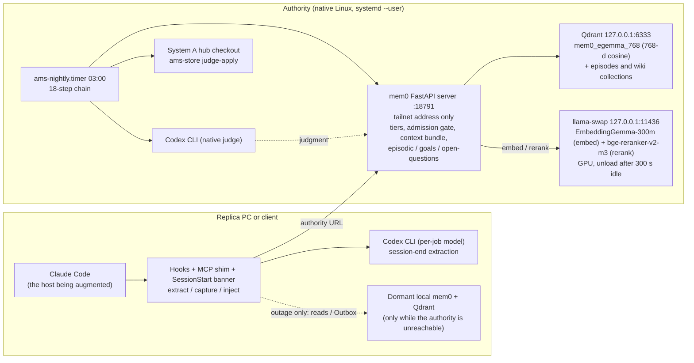
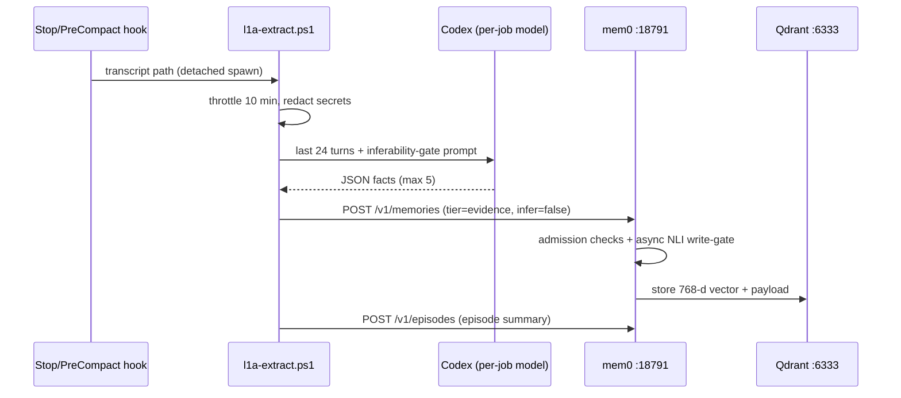
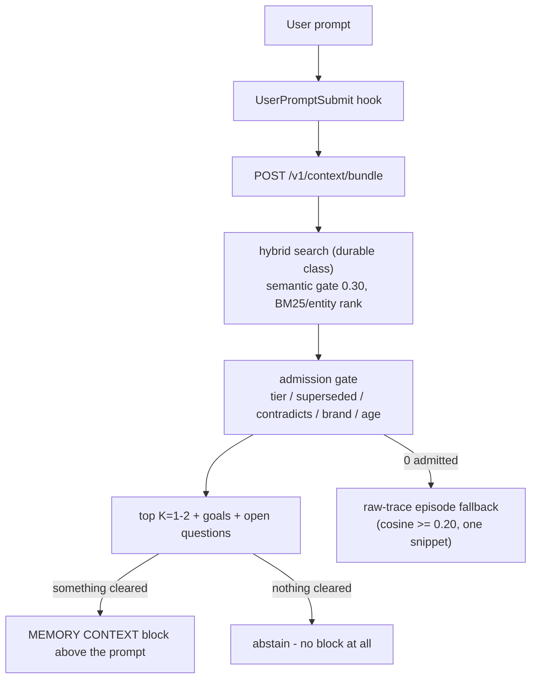

# Architecture

A persistent, multi-tier, **measurably faithful** memory backend for Claude Code: one always-on Linux authority holds the memory, and Windows + WSL2 or Linux PCs use it. This document explains how the whole system works: the six functional layers, the trust-tier memory model, the life of a memory from conversation to retrieval, and the safety invariants that keep a *self-writing* store honest.

> **How to read this doc.** Skim the [bird's-eye view](#birds-eye-view) and the [six layers](#the-six-functional-layers) for the mental model; use the [component code map](#component-code-map) and [ports table](#processes--ports) as reference while reading code. Per-component deep-dives live in `docs/systems/`; end-to-end pipeline walkthroughs in `docs/flows/`; day-2 operations in [`docs/operations.md`](./docs/operations.md); the API surface in [`docs/api-contracts.md`](./docs/api-contracts.md); the full doc map in [`docs/README.md`](./docs/README.md).

**Current shape** (see the `VERSION` file for the release): one **authority**, a native-Linux box, runs the memory server, Qdrant, llama-swap (the embedder and the reranker, on the GPU) and the one nightly chain of 18 steps, with the Codex CLI on demand as the judge; every other machine is a **replica PC** or **client** whose Claude Code hooks, MCP shim and SessionStart banner talk to the authority. See [Topology](#topology-one-authority-many-pcs).

---

## Topology: one authority, many PCs

Exactly one box holds write authority (the [One-Brain Rule](./docs/architecture/decisions/one-brain-rule.md)). Every other machine reads and writes through it.

| Role | Host | What runs there |
|---|---|---|
| **Authority** ("brain": `role=brain`, `MEM0_HOST_KIND=native`) | an always-on Linux box, no WSL and no Windows user | The mem0 server as a systemd `--user` service, bound to the box's **tailnet address** on `:18791` (never a wildcard); Qdrant on loopback `:6333`; llama-swap on loopback `:11436` serving the embedder and the reranker as **GPU models that unload after 300 s idle**; the `ams-nightly.timer` chain; the Codex CLI as the native judge (`MEM0_CODEX_TRANSPORT=native`); and, when a hub is configured, the System A store binary (`ams-store`) with the hub checkout it judges. The three keys (API, canonical and, since 1.32.5, the service key) are systemd credentials (`LoadCredentialEncrypted=`), not files in a home directory. Installed by `install/linux-authority.sh`. |
| **Replica PC** (`role=replica`) | a Windows + WSL2 workstation (`install.ps1 -Role replica`) or a Linux box (`install/linux-replica.sh`) | The Claude Code hooks, the MCP shim and the SessionStart banner, all pointed at the authority through `~/.mem0/authority-url`. A local mem0 and Qdrant are installed but **dormant**: an offline watcher starts them only while the authority is unreachable, reads then fail over to that read-only copy and writes queue in the Outbox and replay on reconnect ([offline and travel](./docs/systems/offline-travel.md)). No nightly job runs on a replica. |
| **Client** (`role=client`) | a Linux box (`install/linux-client.sh`) | The same hooks and shim with no local store at all; offline, reads return the shim's offline result and writes queue. |

**Host kinds.** `MEM0_HOST_KIND=native` (recorded in `~/.mem0/stack.env` by the installers) is a plain Linux box; the other kind is a WSL2 distro on a Windows PC. A Windows + WSL2 box can still be installed as the authority (`install.ps1 -Role brain`, with Task Scheduler and per-job timers doing what the chain does below), but the shipped deployment is the native one and this document describes it. `deploy.sh` is the WSL deploy path and refuses a native host; the authority is deployed by re-running `install/linux-authority.sh` from the updated checkout.

**The one nightly chain.** `ams-nightly.timer` fires at 03:00 local (`Persistent=true`, and the last step arms an RTC wake for 02:45) and starts `ams-nightly.target`. Its steps are `systemd/ams-step-*.service` units ordered by `After=`, never `Requires=`, so a failed step never stops the backup, and each runs through `scripts/wsl/ams-step.sh`, which appends a receipt (`~/.mem0/maintenance/receipts.jsonl`) that `GET /health/maintenance` folds. **The chain is 18 steps:** `dream` → `semantic-dedup` and `store-judge` → `index-refresh` → `wiki-index` beside `goal-recurrence-promote` and `episode-upkeep` (daily, after the dream and before the backup: it closes `in_progress` episodes idle for more than 7 days and embeds the episode vectors a cold embedder missed) → the Sunday jobs `decay-scan`, `goals-stale-sweep`, `contradiction-sweep`, `episodic-reconcile`, `retrieval-pairs` → `stack-backup` → `syncoid` → `pcloud-copy` → `health-stamp` → `morning-summary` (it quotes the stamp, so the stamp runs first) → `rtcwake`. The System A hub and judge (`ams-store`, [System A store client](./docs/systems/ams-store.md)) are part of it: `store-judge` applies the plan the dream wrote for the harness's own per-workspace memory stores to the authority's hub checkout and syncs it. `store-judge` and `wiki-index` are rendered only where a hub or a wiki source is configured, so an install without them runs 16 (details: [installer and deploy](./docs/systems/installer-and-deploy.md), [operations](./docs/operations.md)).

---

## Bird's-eye view

```mermaid
flowchart LR
    subgraph PC["Replica PC or client"]
        CC["Claude Code<br/>(the host being augmented)"]
        HOOKS["Hooks + MCP shim + SessionStart banner<br/>extract / capture / inject"]
        PCCODEX["Codex CLI (per-job model)<br/>session-end extraction"]
        DORMANT["Dormant local mem0 + Qdrant<br/>(only while the authority is unreachable)"]
    end
    subgraph AUTH["Authority (native Linux, systemd --user)"]
        MEM0["mem0 FastAPI server :18791<br/>tailnet address only<br/>tiers, admission gate, context bundle,<br/>episodic / goals / open-questions"]
        QD["Qdrant 127.0.0.1:6333<br/>mem0_egemma_768 (768-d cosine)<br/>+ episodes and wiki collections"]
        LS["llama-swap 127.0.0.1:11436<br/>EmbeddingGemma-300m (embed) + bge-reranker-v2-m3 (rerank)<br/>GPU, unload after 300 s idle"]
        CHAIN["ams-nightly.timer 03:00<br/>18-step chain"]
        JUDGE["Codex CLI (native judge)"]
        STORE["System A hub checkout<br/>ams-store judge-apply"]
    end
    CC --> HOOKS
    HOOKS -->|"authority URL"| MEM0
    HOOKS -.->|"outage only: reads / Outbox"| DORMANT
    HOOKS --> PCCODEX
    MEM0 --> QD
    MEM0 -->|"embed / rerank"| LS
    CHAIN --> MEM0
    CHAIN --> JUDGE
    CHAIN --> STORE
    JUDGE -.->|"judgment"| MEM0
```

Qdrant and llama-swap listen on loopback only; mem0 on the authority listens on its tailnet address only, and every `/v1` call is **API-key-gated** (`X-API-Key`; the five health probes answer without one, see [`docs/api-contracts.md`](./docs/api-contracts.md)). The only cloud dependency is the Codex CLI (ChatGPT OAuth), used strictly as the *LLM for extraction, consolidation, and judgment* — never as a data store.

---

## The six functional layers

Think of a fact's life: **born → stored → trusted → recalled → kept honest → maintained.**

| # | Layer | Job | Key code |
|---|---|---|---|
| 1 | [Capture (write path)](#1-capture--the-write-path) | Turn conversations into durable facts + episodes, automatically | `scripts/windows/l1a-extract.ps1`, `scripts/wsl/dream-consolidate.py`, `mem0-server/episodic.py` — deep-dive: [`docs/flows/memory-capture.md`](./docs/flows/memory-capture.md) |
| 2 | [Storage + hybrid search](#2-storage--hybrid-search) | Persist facts as vectors; find them by meaning + keywords + entities | `mem0-server/app.py`, `mem0-server/config.py`, `mem0-server/egemma_embedder.py` |
| 3 | [Tiers + admission gate](#3-trust-tiers--the-admission-gate) | Rank by trust; hide superseded/contradicted/wrong-brand records at read time | `mem0-server/admission_gate.py`, `mem0-server/freshness.py` |
| 4 | [Recall (read path)](#4-recall--the-read-path) | Put the right 1–2 memories into the agent's context — or abstain | `scripts/windows/user-prompt-extract.ps1`, `scripts/wsl/mem0-mcp-shim.py`, `claude-config/sessionstart_bundle.py` — deep-dive: [`docs/flows/memory-retrieval.md`](./docs/flows/memory-retrieval.md) |
| 5 | [Reconciliation + governance](#5-reconciliation--governance) | Detect and resolve stale/contradicting facts — safely, human-gated | `scripts/wsl/contradiction-sweep.py`, `mem0-server/nli_write_gate.py`, `mem0-server/codex_shim_client.py` — deep-dive: [`docs/systems/reconciliation.md`](./docs/systems/reconciliation.md) |
| 6 | [Ops, security + tools](#6-ops-security--the-tool-surface) | Scheduled hygiene, crypto-gated canonical writes, backups, the MCP tool surface | `scripts/wsl/` maintenance jobs, `mem0-server/security_invariants.py`, `scripts/wsl/mem0-mcp-shim.py` |

### 1. Capture — the write path

Facts are extracted **automatically, with zero user action**, at four moments:

- **Session end / compaction** (`Stop` / `PreCompact` hooks → `stop-extract.ps1` → detached `l1a-extract.ps1`): a Codex subagent reads the last ~24 turns (12 KB cap) under a strict-JSON prompt whose top rule is an **inferability gate** — keep only genuinely project-specific facts a competent outsider could *not* guess (max 5/run, one successful extraction per 10 min). Credential shapes are redacted (`redact.py` server-side + `Redact-Secrets` in the readers) *before* text reaches the LLM or the store.
- **Per prompt** (`UserPromptSubmit` → compiled `mem0-hook-client.exe` → daemon): checkpoints an in-progress **episode** and captures **operator corrections** in real time (`~/.mem0/learn-rules.jsonl`, redacted at write) the moment they happen, and `learn-rules-drain.ps1` posts them to the authority as evidence-tier memories at the next session start (hourly throttle) — no dependence on the nightly run.
- **Nightly at 03:00, on the authority only** (the chain's first step, `dream-consolidate.py`; the Windows `dream-consolidate.ps1` of a Windows-hosted brain exits on any other role, `-Force` included, since 1.28.4): the 4-phase "dream" (orient → gather → consolidate → prune) surprise-weights the last 36 h of the store, synthesizes 1–3 lineage-tracked **insights**, and may autonomously promote at most **3 facts/night** to canonical through the enforced 4C contradiction/corroboration gate. A missed night is made up by the authority itself: the timer is `Persistent=` with an `OnBootSec` re-run, and the chain's boot guard turns a re-run of a completed night into receipted no-ops (the SessionStart catch-up, `dream-catchup.ps1`, belongs to a Windows-hosted brain). The MEMORY.md index refresh is its own step (`index-refresh`), so a down dream can't freeze it. To force a dream by hand: `scripts/wsl/ams-dream-now.sh` on the authority ([operations](./docs/operations.md)).
- **Write-time classification**: evergreen atomic facts become durable records (`tier=evidence`); volatile ship-log narratives fold into the **episode summary** (SQLite + FTS5 ledger `~/.mem0/episodic.db`) instead of polluting durable memory. Oversize writes are rejected at the API — atomicity is enforced at write time.

Failed writes dead-letter to a retry queue (poison-code quarantine, max 5 attempts). Every tier change and deletion appends to the **append-only tier ledger** (monthly segments `~/.mem0/tier-ledger-YYYY-MM.jsonl`).

```mermaid
sequenceDiagram
    participant S as Stop/PreCompact hook
    participant L as l1a-extract.ps1
    participant X as Codex (per-job model)
    participant M as mem0 :18791
    participant Q as Qdrant :6333
    S->>L: transcript path (detached spawn)
    L->>L: throttle 10 min, redact secrets
    L->>X: last 24 turns + inferability-gate prompt
    X-->>L: JSON facts (max 5)
    L->>M: POST /v1/memories (tier=evidence, infer=false)
    M->>M: admission checks + async NLI write-gate
    M->>Q: store 768-d vector + payload
    L->>M: POST /v1/episodes (episode summary)
```

### 2. Storage + hybrid search

- **Store**: Qdrant (systemd-user, loopback :6333), collection `mem0_egemma_768` — 768-d cosine, on-disk. A second collection holds **episode-summary embeddings** for the raw-trace fallback.
- **Embedder**: **EmbeddingGemma-300m** on llama-swap (:11436, on the GPU; it unloads after 300 s idle, so the first call after an idle spell pays a cold load, which the SessionStart pre-warm `GET /health/embedder` absorbs). Multilingual — EN/ES recall@1 ≈ 0.90 both (see [design decisions](#design-decisions-worth-knowing)). It requires *asymmetric task prefixes* (query vs document), applied by the prefix-shim `egemma_embedder.py` installed onto the mem0 embedding model at server start.
- **Server**: a FastAPI wrapper around mem0 2.x (the authority's tailnet address, :18791) that owns the tier protocol, admission gate, context bundle, and the episodic/goals/open-questions sidecar. `/health` and `/health/deep` report the stack version and end-to-end store/embedder health — including the GATING `sparse_leg` BM25-liveness canary.
- **Search is hybrid**: dense cosine is the **gate** (a candidate must clear the semantic threshold), then BM25 keyword + entity boosts shape the returned ranking. The BM25 leg depends on the **fastembed** sparse encoder (explicit in the installer, with a loadability post-condition) — when it is missing, mem0 silently falls back to dense-only, so the GATING `sparse_leg` check on `/health/deep` (a deterministic oldest-point canary) turns that silent fallback into a failed health/deploy gate ([`docs/systems/mem0-api.md`](./docs/systems/mem0-api.md)). The gate is calibrated on the *raw semantic* scale — off-domain tops out ≈0.12, relevant runs 0.25–0.57, so the **0.30 gate** rejects noise with margin. (Raising it was measured to crater recall; calibration record in `eval/injection-gating/`, private repo.)
- **Reranker**: `bge-reranker-v2-m3`, a cross-encoder on the GPU behind the same llama-swap (same 300 s idle unload), applied only where its cost is acceptable — deliberate `memory_search` calls (auto-on at `limit ≥ 5`) — never on the hot per-prompt path. After an idle unload the first search pays a cold load: one budget-bounded retry, then the fail-open dense order, and `rerank_status` says which ([reranker](./docs/systems/reranker.md)).

### 3. Trust tiers + the admission gate

Every record carries a **tier** — the system's trust axis (full treatment, incl. lifecycles + query classes + the memory-type axis: [`docs/systems/memory-model.md`](./docs/systems/memory-model.md)):

| Tier | Meaning | Written by | Decays? |
|---|---|---|---|
| `canonical` | Locked ground truth | HMAC-signed CLI / dream auto-promote (≤3/night, gated) — **never** via plain `add` | No |
| `stable` | Durable settled facts | promotion | No |
| `insight` | Nightly-consolidated higher-order learnings | dream consolidator only, proved by the service key | No |
| `evidence` | Default for auto-captured facts | extractor / MCP `memory_add` | Yes — Weibull, ~365-day half-life on the durable path (env-gated) |
| `temporal` | Explicitly time-bound facts | extractor / MCP | Yes — expiry + operational recency decay (~30-day half-life) |

`ADD_ALLOWED_TIERS = {evidence, temporal}` (plus `insight` for the dream consolidator, which the server accepts only when the request carries the service key; no MCP session holds it, so `memory_add` over MCP always downgrades `insight` to `evidence`); `canonical` writes require an HMAC token, and so does a move out of `canonical` or `insight` — see [security](#6-ops-security--the-tool-surface).

At **read time** every hit passes the **admission gate** (`admission_gate.py`) for its query class (`durable` / `operational` / `canonical` / `history`):

- hidden if **superseded** (`superseded_by`, written only by `POST /v1/memories/{id}/supersede`, a session's `memory_supersede` or the operator's resolve step; a *partial* supersession, `partially_superseded_by`, annotates one stale claim and never hides) or **contradicting canonical** (`contradicts_canonical`) — except in the forensic `history` class, which keeps everything reachable;
- hidden on **brand/workspace mismatch** — isolation is *fail-closed*: a brandless search returns only brand-neutral records; a branded search never leaks another brand;
- `operational` additionally enforces a recency cap; rejections log to `~/.mem0/admission-rejected.jsonl` for observability;
- the **local-judge advisory flag** (`contradicts_canonical_pending`) is *deliberately not enforced* — only an authoritative Codex verdict hides a record.

**Freshness** is tier-scoped Weibull decay (`freshness.py`): `w = exp(−ln2 · (age/η)^κ)`. The operational read path decays all results by age; the durable path decays only `evidence` (`DURABLE_DECAY_TIERS`). Canonical/stable/insight never decay — atemporal knowledge shouldn't age out.

### 4. Recall — the read path

Four delivery channels, all precision-first:

1. **Per-prompt injection** (`UserPromptSubmit` → one `POST /v1/context/bundle` round-trip): the top **K = 2** (frontier models) / **K = 1** (small) memories that clear the **0.30** gate, plus open goals/questions, rendered as a `[MEMORY CONTEXT]` block above the prompt. **Abstention-first**: if nothing clears the gate, no block renders at all. Unchanged goals/OQ are not re-injected every prompt; the `insight` tier is filtered server-side from this hot path; client-side defense-in-depth caps and truncates before anything reaches context.
2. **Explicit deeper recall** (`memory_recall` MCP tool), in addition to the per-prompt injection: the same gated bundle **plus** a separate `canonical`-class search — the curated "what do we know" call for when the injected block is empty, for canonical facts (the hook never injects them) or for another brand's scope.
3. **Deliberate search** (`memory_search` MCP tool): free-text semantic search with the cross-encoder reranker auto-on at `limit ≥ 5`.
4. **Session start** (`sessionstart_bundle.py`): a resume précis — after a compaction it reuses the **PreCompact-captured conversation query** (K=2); on a cold boot it builds a recency pseudo-query (K=1, precision-first).

When the condensed search admits nothing, a **raw-trace fallback** may surface one past-episode snippet (raw cosine floor 0.20, fail-closed on brand) — recall of lived history without breaking abstention.

```mermaid
flowchart TD
    P["User prompt"] --> H["UserPromptSubmit hook"]
    H --> B["POST /v1/context/bundle"]
    B --> S["hybrid search (durable class)<br/>semantic gate 0.30, BM25/entity rank"]
    S --> AG["admission gate<br/>tier / superseded / contradicts / brand / age"]
    AG --> K["top K=1-2 + goals + open questions"]
    K -->|"something cleared"| INJ["MEMORY CONTEXT block above the prompt"]
    K -->|"nothing cleared"| ABS["abstain - no block at all"]
    AG -->|"0 admitted"| RT["raw-trace episode fallback<br/>(cosine >= 0.20, one snippet)"]
```

### 5. Reconciliation + governance

A self-writing store drifts unless something hunts stale and contradicting facts. Two detectors + one write-time guard, under a **safe-by-default resolution policy**:

- **Canonical contradiction sweep** (weekly, a Sunday chain step): for each canonical fact, judge near-duplicate non-canonical candidates — *"does B contradict A?"*. All sweep judgment routes to **Codex** through the judge transport (the native Codex CLI on the authority; the Windows HTTP shim, :18792, on a host without native transport); local models are never the judge (a measured 78% false-positive rate killed that design).
- **Evidence-vs-evidence supersession sweep** (`--evidence-sweep`): anchors on recent facts, finds *older near-duplicate* neighbors, and asks the **supersession judge** a different question — *"would re-reading the older fact mislead about the CURRENT state?"* → `STALE` / `KEEP`, default KEEP. The distinction matters: a valid historical ship-log logically *supersedes* but must be **kept**; reusing the contradiction prompt over-flagged ~2/3 of pairs, and the dedicated judge measured precision 35% → 67% at 100% genuine recall.
- **NLI write-gate** (async, opt-in): flags a *new* record that contradicts canonical truth at write time — fast cosine pre-filter, Codex judge only on high-similarity neighbors, fail-open on any uncertainty.
- **Resolution policy — queue-gated hides**: re-judging **auto-clears** false flags (always safe, always automated); evidence-vs-evidence hides and pending-flag promotions route to the **human review queue** (`~/.mem0/contradiction-promote-review.jsonl`; depth surfaced in the SessionStart banner) — `--promote <id>` is the human-confirmed enforce, `--unstamp <id>` the one-command recovery (both stamp under a job label, so a hand run on the authority goes through `scripts/wsl/ams-service-run.sh`, which supplies the service key); a `supersede` line is resolved with `--resolve-supersede <id> --winner <id>` through the supersede endpoint and undone with `--unsupersede <id>`, and `--supersede-markers` converts the hand-written `SUPERSEDED` text markers sessions left before that door existed. The **weekly canonical sweep is the exception**: its authoritative Codex YES verdicts stamp directly (recoverable via `--unstamp`; forensic `history` always sees hidden records). The queue exists because a live auto-enforce incident hid 3 consistent facts out of 4 — see `docs/systems/reconciliation.md` for the per-path matrix.

### 6. Ops, security + the tool surface

**Scheduled hygiene** (all unattended). On the authority everything scheduled is the one chain above: 18 steps, one receipt each.

| Step | Runs | What |
|---|---|---|
| `dream` | nightly | consolidate → insight, gated canonical autopromote, prune/index, drift canaries; skips below the Codex quota reserve |
| `semantic-dedup` | nightly | tier-scoped near-duplicate removal; deleted payloads preserved in `dedup-report.jsonl` |
| `store-judge` | nightly, with a hub | applies the dream's System A plan to the hub checkout and syncs it |
| `index-refresh` | nightly | MEMORY.md index refresh, decoupled from the dream |
| `wiki-index` | nightly, with a wiki source | the LLM Wiki's semantic index (backstop for the session-side refresh) |
| `goal-recurrence-promote` | nightly | promotes goals that recur across sessions |
| `episode-upkeep` | nightly, after the dream | closes `in_progress` episodes idle for more than 7 days (rows kept, never deleted) and embeds the episode summaries whose vector a cold embedder missed (a per-id diff, at most 200 a night); the receipt names the missing episodes and reads `degraded` while any is still missing |
| `decay-scan`, `goals-stale-sweep`, `contradiction-sweep`, `episodic-reconcile`, `retrieval-pairs` | Sundays (`--weekly Sun`) | expire/flag decayed records; stale goal hygiene; weekly Codex-judged contradiction pass; mem0 ↔ episodic link reconciliation (orphan detection, stale in-progress episodes, embedding back-fill); retrieval-pair judging |
| `stack-backup` | nightly | SQLite online backups + Qdrant snapshots + ledgers/config, integrity-checked, with a manifest. **Retention: last 8 daily snapshots kept ≈ an 8-day restore window**; the only step that stamps `last-chain-success` |
| `syncoid` | nightly, when its script exists | off-box ZFS replication of the dataset |
| `pcloud-copy` | nightly | mirrors the newest complete set to the cloud folder (refuses a stale or failed set) |
| `health-stamp` | nightly | pulls `/health/maintenance`; red on a failed step or an unhealthy pool |
| `morning-summary` | nightly | the night's receipts as a summary section, quoting tonight's stamp (1.34.0: it runs after `health-stamp`, so a failure in it or in `rtcwake` reaches `/health/maintenance` the next night) |
| `rtcwake` | nightly | arms the RTC wake for the next 02:45 |

Outside the chain, `l10-audit.timer` runs every 6 h: heuristic flags for oversize / injection-shaped / credential-shaped / missing-provenance writes, and slow-drip detection. On a replica PC the stack schedules only its offline watcher (plus the legacy compactor task, on a box whose store-hub path is not yet proven); the rest is hook-driven (session start spawns the correction drain, the index refresh and the wiki catch-up). A Windows-hosted brain runs the same jobs from Task Scheduler and per-job timers instead of the chain ([installer and deploy](./docs/systems/installer-and-deploy.md)).

**Security posture**:

- Qdrant and llama-swap are loopback-only, and mem0 binds the authority's tailnet address, never a wildcard (a persisted nft table, `ams-nft.service`, drops :18791 and :6333 arriving on any interface but `tailscale0` and loopback); `X-API-Key` on every `/v1` call (constant-time compare), the five health probes excepted.
- **Canonical is cryptographically locked**: promotion/edit/delete requires an HMAC-SHA256 format-2 token (timestamp + burned nonce + reason) signed with a key that never rests as a plain file on the authority: it is a systemd credential (`LoadCredentialEncrypted=ams-canonical-key`, delivered under `$CREDENTIALS_DIRECTORY`), which `/health/deep` reports as `canonical_key.source: credential`. On a Windows-hosted brain the key rests as a Windows-DPAPI blob injected into RAM-backed tmpfs at service start, a **per-box operator act**; until it is performed it rests as a mode-600 plaintext file, reported the same way (see [`docs/systems/dpapi-canonical-key.md`](./docs/systems/dpapi-canonical-key.md)). Either way no plain `add` can ever create canonical — the HMAC gate is unaffected by where the key rests.
- **Server-side job labels are proved, not trusted** (1.32.5). The server used to honour free-text `actor` and `metadata.source` labels sent with the ordinary API key, which every PC and every MCP shim session holds: the dream's and the consolidators' insight labels, the sweep's and the retire stamper's metadata stamps, the backfill and decay labels. Any holder could type one to hide non-canonical records, schedule a deletion, or mint, rewrite and delete insights. Such a label now counts only when the request also carries the **service key** in `X-AMS-Service-Key`; without it the write is a 403 `service-credential-required` (an ordinary write needs no label). The key is authority-only: a systemd credential (`ams-service-key`, loaded by `mem0.service` and by the dream, contradiction-sweep and hand-run units) or, on a WSL-hosted brain, `~/.mem0/service-key` (mode 600). No replica, PC or MCP session holds it, so a dormant replica's server refuses every privileged label by design. It is a separate secret from the canonical key (a job holding it cannot sign a canonical token) and it is regenerable: nothing outside the authority needs a copy, and `install/linux-authority.sh` makes a missing or undecryptable one and fails unless `/health/deep` reports `checks.service_key.present`. The policy functions in `security_invariants.py` fail closed: they take `service_verified` (default false), so a write handler that forgot the gate denies rather than allows.
- **Insight is locked in both directions.** A move out of `insight`, like a move out of `canonical`, needs the operator's signed `demote` token (`mem0-canonize.sh --action demote <id> "<reason>"`). No job label exempts it, since nothing in the stack demotes an insight. A tier change that was unsigned when it began and finds the record `canonical` or `insight` by the time it holds the record lock is a 409. The MCP `memory_demote` and `memory_promote` therefore cannot move an insight; a bad one leaves through the signed demote or a signed delete.
- **What the service key does and does not stop.** It separates the authority's own jobs from every caller that holds only the shared API key (MCP shim sessions, hooks, PCs, replicas). It does not resist a shell on the authority as the service user, an ssh session to the brain or, on a WSL-hosted brain, a Windows-side process of the same user, and it is one key for every job, not per-job least privilege. Known gaps it does not close: writes that need no forged label and are no worse than the `DELETE` every key holder already has on `evidence`, `stable` and `temporal` records (`PATCH /tier` to `temporal`, which hides a record from every query class; `_canonical_intent`; the supersede door on unprotected tiers; `retired_at` on non-canonical records); caller-chosen `source` labels that the server's own jobs read (the autopromote corroboration fast-track's `user-decision` / `operator-decision`, whose legitimate sender is an unprivileged PC hook, and semantic-dedup's `automemory:` protection), which need a different design; and the ledger's `transport` field, which is self-declared from header presence.
- Server-side `add()` strips caller-forged gating metadata (`contradicts_canonical`, `superseded_by` and the supersede door's `superseded_at` / `superseded_via` / `partially_superseded_by`, `retrievable`, …). No metadata-PATCH actor may write `superseded_by`, and none may put a hide key on a canonical record: a supersession goes only through `POST /v1/memories/{id}/supersede`, whose refusal matrix the server enforces whoever calls.
- Judge prompts treat memory text as **untrusted data** inside delimiter blocks with closing-tag neutralization (prompt-injection defense, pinned by tests). The native judge's `codex exec` child also starts without the credential pointers (`CREDENTIALS_DIRECTORY`, `MEM0_API_KEY_FILE`, `MEM0_KEY`, `MEM0_API_KEY`); that removes the pointer, not the files, so the sandbox is the real boundary.
- Secrets are redacted at every chokepoint: session readers, extraction prompts, and the server checkpoint path.

**Tool surface**: the MCP shim (`scripts/wsl/mem0-mcp-shim.py`) exposes its tool family to Claude Code — `memory_*` (recall / search / add / promote / demote / update / health…), `episodic_*`, `goals_*` / `goal_*`, `open_question(s)_*` — contract in [`docs/api-contracts.md`](./docs/api-contracts.md).

---

## The memory-type view

The same system mapped to the cognitive taxonomy used in agent-memory literature:

| Memory type | Implementation | Depth |
|---|---|---|
| Semantic (facts) | durable mem0 records (evidence/stable/canonical) — the core | ★★★ |
| Episodic (events) | `episodic.db` sessions/episodes ledger + raw-trace fallback | ★★★ |
| Working (current task) | per-prompt `[MEMORY CONTEXT]` + in-progress episode checkpoint | ★★ |
| Short-term | `temporal` tier + operational recency decay | ★★ |
| Long-term | `stable`/`canonical` — no decay, backed up daily | ★★★ |
| Prospective (intentions) | goals tree + open questions, surfaced each session | ★★ |
| Procedural (how-to) | thin by design — how-to *lessons* store as semantic facts; executable procedures belong to Claude Code skills, not this store | ★ |
| Associative | entity boosts in hybrid search | ★ |

The axis human memory doesn't have: **trust** (tiers + the admission gate). It's what keeps a self-writing store from poisoning itself.

---

## Safety invariants (the contract)

1. **Nothing is hidden below an authoritative verdict, and nothing is unrecoverable.** Only a Codex verdict can hide a record (evidence-vs-evidence and re-judge hides additionally require a human `--promote`; the weekly canonical sweep enforces directly); every hide is one-command reversible and the forensic `history` class always sees it.
2. **Canonical is unforgeable.** HMAC + nonce replay protection (+ DPAPI key-at-rest where the per-box cutover has been performed); `add()` can never set it.
3. **Local models never judge.** Embedding + reranking only; all contradiction/supersession/consolidation judgment is Codex.
4. **Brand isolation is fail-closed**, at the server *and* the client render.
5. **Abstention over noise.** No memory clears the gate → no injection at all.
6. **Every mutation is auditable.** Append-only tier ledger (monthly segments); deletion reports preserve full payloads for restore.
7. **Fail-open on the hot path, fail-visible in the background.** Hooks never block Claude Code; scheduled jobs exit nonzero and surface banners when degraded.
8. **Untrusted text stays data.** Memory content is delimiter-boxed in every judge prompt.

---

## Component code map

The short codes used across `docs/systems/`, `docs/flows/`, and code comments:

| Code | Component | Current home |
|---|---|---|
| L1a | Session fact extractor | `scripts/windows/l1a-extract.ps1` |
| L10 | Heuristic audit (6 h) | `scripts/wsl/l10-audit.py` |
| C1 / "dream" | Nightly consolidator | `scripts/wsl/dream-consolidate.py` (the authority's chain step; `scripts/windows/dream-consolidate.ps1` on a Windows-hosted brain) |
| 4C | Promotion gate (contradiction/corroboration, enforced) | `scripts/wsl/autopromote_lib.py` (`scripts/windows/autopromote-lib.ps1` on a Windows-hosted brain) |
| M1 | mem0 API server | `mem0-server/app.py` |
| M3 | Vector index | Qdrant `mem0_egemma_768` |
| R1 | Embedder | EmbeddingGemma-300m via `mem0-server/egemma_embedder.py` |
| R2 | Reranker | `mem0-server/reranker.py` (bge cross-encoder; deliberate-search path) |
| R4 | Raw-trace episode fallback | `app.py` `_episode_raw_fallback` + `episode_embeddings.py` |
| R5 | Governance (write-gate / freshness / reconciliation) | `nli_write_gate.py`, `freshness.py`, `contradiction-sweep.py` |
| R6 | Placement / attention hygiene | `user-prompt-lib.ps1` `Format-MemoryContextBlock` |
| 0.D | Per-prompt bundle render | `user-prompt-extract.ps1` + compiled `mem0-hook-client.exe` |
| B1 | SessionStart enrichment + PreCompact top-up | `claude-config/sessionstart_bundle.py`, `precompact_capture.py` |

Historical codes you may meet in old notes: M2 (an episodic MCP surface removed in v0.13 — episodic memory was later rebuilt as `episodic.py` + the `/v1/episodes` API), I2 (an optional prompt-classifier gate, disabled by default).

## Processes & ports

| Port | Process | Runs as |
|---|---|---|
| :18791 | mem0 FastAPI server | systemd-user `mem0.service`; on the authority it binds the tailnet address (a dormant replica's copy binds loopback) |
| :6333 | Qdrant | systemd-user, loopback |
| :11436 | llama-swap (EmbeddingGemma + bge-reranker-v2-m3, on the GPU, 300 s idle unload) | on the authority a host process on loopback; on a Windows PC per-host: WSL systemd-user *or* Windows-native (e.g. a scheduled task) — mirrored networking serves `:11436` either way; see the operations runbook before restarting |
| :18792 | Codex HTTP shim (judgment bridge) | Windows PowerShell daemon (flag-gated, idle-shutdown); not installed on the native authority, which runs `codex exec` itself |
| — | Codex CLI | on-demand, ChatGPT OAuth, shared lock (extractor / dream / shim never run it concurrently) |

Why the shim exists: on a Windows-hosted brain Codex runs Windows-side (its stdout is only clean there) while the sweeps run WSL-side, so the shim moves *only clean JSON over loopback TCP* across that boundary, authenticated with the same API key. The native authority has no such boundary and calls the Codex CLI directly.

---

## Design decisions worth knowing

### Why Codex CLI (not Claude) as the subagent LLM

Anthropic's Claude Max OAuth enforces a single concurrent session per account: when Claude Code is open, subprocess `claude --print` calls from hooks fail intermittently with "Not logged in" (verified extensively — detached PowerShell, WSL-bridged, `WSLENV` forwarding; all unreliable while an interactive session holds the slot). Codex CLI authenticates via a **ChatGPT subscription** (separate OAuth surface), runs reliably headless from any Windows shell at zero marginal cost, and matches quality for structured extraction. Hence the rule: **all LLM judgment routes to Codex; local models do embedding/reranking only.**

### Why mem0 with a custom FastAPI wrapper

mem0's official server is Docker-first and Windows-fragile under WSL2. The wrapper (`mem0-server/app.py`) exposes the same REST surface plus everything the stock server lacks: the tier protocol, admission gate, context bundle, episodic/goals/open-questions sidecar, and the HMAC-gated `PATCH /v1/memories/{id}/tier`.

### Why Qdrant

Production-grade, single binary, persistent on disk, first-class mem0 support. (Chroma: simpler but slower; FAISS: no native persistence; pgvector: drags in Postgres.)

### Why EmbeddingGemma-300m

The corpus is EN+ES; the previous `nomic-embed-text` is structurally English-only — a measured defect (ES recall@1 0.33 vs EmbeddingGemma 0.93 on 30 real query pairs; EN a tie ≈0.9). EmbeddingGemma needs asymmetric task prefixes that neither llama.cpp nor stock mem0 applies — `egemma_embedder.py` is that shim. The migration re-embedded the full corpus into a new collection (`mem0_egemma_768`) because the vector spaces differ, recalibrated the search gate 0.4 → 0.30 (EmbeddingGemma's compressed cosine scale), and allowed Ollama to be fully decommissioned. An earlier EmbeddingGemma trial had been wrongly rejected — the test predated the prefix shim.

### Why the 0.30 gate is not higher

On EmbeddingGemma's scale, 0.35 craters recall to ~0.47 and 0.50 drops everything. Precision comes from admission + tiers + abstention, not a blunt threshold.

### Why never auto-hide

Measured over-promotion on both judge designs (78% FP local; 3/4 wrong on early Codex auto-enforce) made human-gated hides the only safe default.

### Why two sweep judges

"Does B contradict A?" and "should the older fact be hidden as stale?" are different questions; conflating them flags valid history (measured 35% → 67% precision fix at 100% recall).

### Why a 3am consolidation

The operator is asleep and there is no Codex quota competition; the authority is always on, and its last step arms an RTC wake for 02:45 anyway. Once-daily prevents semantic drift (re-running on unchanged evidence yields near-duplicate insights). Robustness is layered on top: the timer is `Persistent=` and re-runs at boot, and the index refresh is its own step.

### Why the L10 audit is heuristic-only at 6 h

Catches poisoned/oversize/credential-shaped writes within a working day, at zero LLM cost. Auto-promotion by shelf-time was deliberately **disabled** — age is not truth.

## Failed approaches (do not retry)

- `claude --print` subprocess from any context → intermittent "Not logged in" (Max concurrent-session enforcement).
- WSL bash → `claude.exe` interop → fails regardless of `WSLENV` forwarding.
- Local llama-swap models as extraction/judgment LLMs → failed quality benchmarks (and the 78% FP judge incident).
- Paid Anthropic API key → out of scope by design (no paid APIs beyond existing subscriptions).
- Lexical/BM25 gate for the episode fallback → disproven live (cannot separate off-domain keyword-dense episodes); rebuilt semantic.
- A single sim-floor as the supersession precision fix → rejected with evidence (false pairs are *more* similar than genuine ones).

## History

The repo evolved v0.12 → v1.x through research-grounded, adversarially-audited increments (each release audited to 0 critical/high findings before merge). Release notes ship here in `CHANGELOG.md`, the product's version authority. The rest of the development trail — research fit-analyses, build plans, eval baselines — is not part of the shipped product and lives in a separate maintainer archive (`docs/research/`, `docs/superpowers/plans/`, `eval/`).
