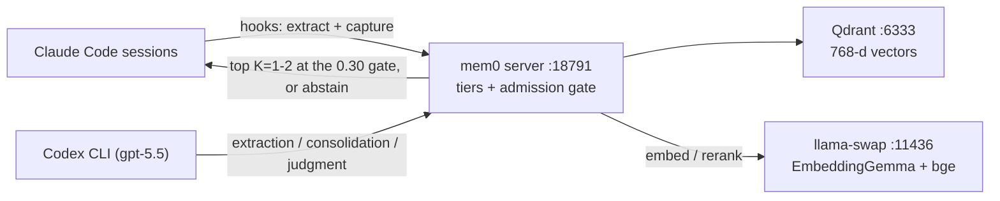

# Agentic Memory Stack for Claude Code

[](https://github.com/dmmdea/agentic-memory-stack-for-claude-code/actions/workflows/ci.yml)

A persistent, multi-tier, **measurably faithful** memory backend for [Claude Code](https://docs.claude.com/en/docs/claude-code) on Windows + WSL2. It captures durable facts from your sessions, consolidates them into higher-order insights, surfaces the right one before each prompt, and governs against drift — with a causal-intervention eval proving the memory actually changes behavior.

> **What it is:** semantic memory (mem0 + Qdrant + EmbeddingGemma), background extraction (Codex CLI), nightly consolidation (Task Scheduler), tiered trust (evidence → insight → canonical), an episodic/goals/open-questions sidecar, and a DPAPI-isolated canonical-key credential.
>
> **What it is NOT:** a Claude Code feature. It's external infrastructure you install once — WSL systemd services + Windows Claude Code hooks.

## What you get

- **Zero-effort capture** — facts are extracted from your sessions automatically (session end, compaction, per-prompt correction capture, nightly consolidation), behind an inferability gate that keeps generic noise out and a redaction chokepoint that keeps credentials out.
- **Right memory, right moment** — the top 1–2 relevant memories are injected above each prompt (or *nothing*, if nothing clears the calibrated relevance gate); `memory_recall` / `memory_search` MCP tools for deliberate pulls; a resume précis at session start.
- **Trust, not just recall** — five tiers from auto-captured `evidence` up to HMAC-locked `canonical` ground truth; an admission gate hides superseded, contradicted, or wrong-workspace records at read time; time-sensitive tiers age out on a Weibull curve.
- **A memory that polices itself** — weekly Codex-judged contradiction sweeps, an on-demand supersession sweep, an optional write-time NLI gate, and a queue-gated resolution policy: false flags auto-clear, evidence-vs-evidence hides are human-confirmed, and every hide is one-command reversible and forensically visible.
- **Boring-by-design operations** — nightly/weekly hygiene (dedup, decay, audit, backups ×8 with integrity checks), an append-only audit ledger, loopback-only + API-key security, ~28 MCP tools.



## Documentation

| You want to… | Read |
|---|---|
| Understand how it all works | **[ARCHITECTURE.md](./ARCHITECTURE.md)** — layers, tiers, data flow, invariants, design decisions |
| Install it | this README (below) + [the installer skill](./skill/install-agentic-memory-stack/SKILL.md) + [llama-swap setup](./install/llama-swap-setup.md) |
| Operate / debug it | [docs/operations.md](./docs/operations.md) — symptom → fix, schedules, the review queue |
| Move to a new machine | [docs/MIGRATION.md](./docs/MIGRATION.md) — keep your memory; code fresh, data restored, keys re-provisioned |
| Change the stack itself | [docs/DEVELOPMENT.md](./docs/DEVELOPMENT.md) — repo tour, tests, the deploy path, release ritual |
| Call its API / tools | [docs/api-contracts.md](./docs/api-contracts.md) — the REST + MCP contract |
| Everything else | **[docs/README.md](./docs/README.md)** — the full documentation map |

## Install

The installer is **self-contained, idempotent, and operator-agnostic** (it detects your WSL distro and derives every path from your own home/username). In Windows PowerShell, from the repo root:

```powershell
.\install.ps1                          # auto-detects your default WSL distro
.\install.ps1 -Distro <your-distro>    # multi-distro / non-default; see: wsl -l -q
```

Fresh machine: `git clone <this repo> $HOME\agentic-memory-stack`, then `cd` in and run the same. The 4-phase installer (`prereqs → WSL services → Windows config → verify`) halts with an exact fix if any prerequisite is missing. Safe to re-run for upgrades/repair. See **[skill/install-agentic-memory-stack/SKILL.md](./skill/install-agentic-memory-stack/SKILL.md)** for the full walkthrough and **[skill/install-agentic-memory-stack/references/troubleshooting.md](./skill/install-agentic-memory-stack/references/troubleshooting.md)** for the matrix.

## Prerequisites (verified by `install\0-prereqs.ps1`)

| Component | Why |
|---|---|
| Windows 10+/11, PowerShell 5.1+ | Host OS / install runtime |
| WSL2 with a Linux distro, `mirrored` networking, systemd enabled | Storage backend (mem0/Qdrant) runs here |
| Python 3.12+ in WSL | mem0 server |
| Node.js 22+ (WSL + Windows) | Codex / Claude CLIs |
| [llama-swap](https://github.com/mostlygeek/llama-swap) on `:11436` in WSL (llama.cpp ≥ b6384) | Serves the EmbeddingGemma embedder + bge-reranker (CPU). No Ollama. |
| [Claude Code](https://docs.claude.com/en/docs/claude-code) (Windows, npm) | The host you're augmenting |
| [Codex CLI](https://github.com/openai/codex) (npm) authenticated against an active ChatGPT subscription | Subagent LLM for background extraction + nightly consolidation |
| `git` for Windows | — |

## Why Codex (and not Claude) as the subagent?

Claude Max OAuth enforces a single concurrent session — headless `claude --print` from hooks fails intermittently when an interactive session holds the slot (by design; headless agentic workloads are Anthropic's paid-API territory). Codex CLI authenticates via your **ChatGPT subscription** (separate OAuth, no concurrency block) and runs reliably headless from any Windows shell at zero marginal cost; quality matches for structured extraction. **All LLM judgment routes to Codex; local llama-swap models do embedding/reranking only.**

## Architecture

See **[ARCHITECTURE.md](./ARCHITECTURE.md)** for the full data-flow diagram and **[skill/.../references/architecture.md](./skill/install-agentic-memory-stack/references/architecture.md)** for the v1.0 summary. Live runtime processes: `mem0-server` (:18791) + Qdrant (:6333) + llama-swap (:11436, EmbeddingGemma + bge-reranker) + Codex CLI, plus the Claude Code hooks. Trust tiers: evidence → insight → canonical (HMAC-gated, CLI-only promotion).

### v1.0 faithfulness (R1–R6)

The stack went from "store + inject and hope" to "measurably faithful memory": a causal-intervention eval (R1), specificity-first extraction (R3), abstention-first gated injection (R2), write-gate + freshness + reconciliation governance (R5), attention-hygiene placement (R6), and a low-confidence raw-trace fallback (R4). Each is research-grounded and adversarially audited (full research notes and changelog live in the private development repo; releases carry the public notes).

## Files in this repo

| Path | What |
|---|---|
| `install/` + `install.ps1` | The 4-phase idempotent, operator-agnostic installer |
| `scripts/windows/` | PowerShell runtime: hooks, the compiled UserPromptSubmit client, extractor, consolidator, `Test-MemoryStack` |
| `scripts/wsl/` | mem0 MCP shim, audit/decay/dedup/backup/restore/reconcile, canonize CLI, index builder |
| `mem0-server/` | FastAPI wrapper around mem0 2.0.4 (+ episodic/goals/open-questions, admission gate, freshness, NLI write-gate, Codex shim client) |
| `systemd/` | systemd-user units (services + timers) |
| `claude-config/` | CLAUDE.md tier-protocol snippet, model-tiers, storage-cap-check, `settings.example.json` |
| `skill/install-agentic-memory-stack/` | The Claude Code installer skill (`SKILL.md` + `references/`) |
| `eval/` | The faithfulness + retrieval eval harnesses and probe sets *(maintainer archive only — not part of this public repo)* |
| `docs/` | Operations, API contract, per-system and per-flow deep-dives — see [docs/README.md](./docs/README.md) for the map |

## License

Apache-2.0 — the `LICENSE` + `NOTICE` + `THIRD-PARTY-NOTICES.md` files ship with the public release.
