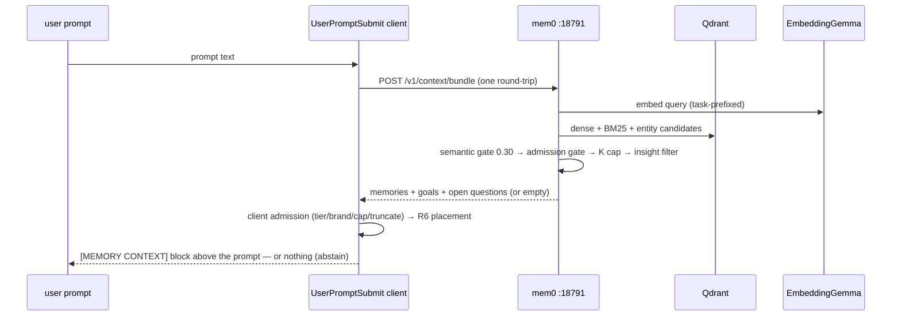

# The retrieval pipeline — how the right memory reaches the agent

## Purpose

Deep-dive on layers 2 + 4 of [`ARCHITECTURE.md`](../../ARCHITECTURE.md): embedding, hybrid scoring, the calibration story, and the four delivery channels. The design bet across the layer: **precision first** — a wrong or irrelevant injected memory costs more than a missed one, because the consuming model treats injected context as signal.

## Trigger

Retrieval fires through four channels, each with its own trigger:

- **Per prompt** — every `UserPromptSubmit` fires one `POST /v1/context/bundle` (Channel 1, working memory).
- **Deliberate recall** — an agent calls `memory_recall` before acting (Channel 2).
- **Deliberate search** — an agent calls `memory_search` with explicit `limit`/`threshold`/`query_class`/`brand` control (Channel 3).
- **Session start** — `sessionstart_bundle.py` runs at SessionStart, consuming a fresh PreCompact marker or building a cold-boot recency query (Channel 4).

## Participants

- **The `UserPromptSubmit` client + resident daemon** — issues the per-prompt bundle round-trip and applies client-side admission and placement.
- **The mem0 server** (`:18791`) — the bundle / search / recall endpoints, the semantic gate, the K-cap, and the insight filter.
- **EmbeddingGemma-300m** on llama-swap (`:11436`) — the asymmetric 768-d embedder, with the `egemma_embedder.py` prefix shim.
- **Qdrant** — the vector store the dense / BM25 / entity legs query.
- **The bge cross-encoder reranker** on `:11436` (`reranker.py`) — the deliberate-path reorder.
- **`sessionstart_bundle.py`** — the session-start précis.
- **The mem0 MCP shim** (`mem0-mcp-shim.py`) — where `memory_recall` / `memory_search` and the separate canonical-class search live.

## Step-by-step flow

### Embedding: the prefix shim

EmbeddingGemma-300m (llama-swap, CPU, 768-d) is **asymmetric**: queries and documents must be embedded with different task prefixes (`task: search result | query: …` vs `title: none | text: …`). Neither llama.cpp nor stock mem0 applies them — `egemma_embedder.py` is the shim, installed onto the mem0 embedding model at server start. This detail is load-bearing: an earlier EmbeddingGemma trial was *wrongly rejected* as worse-on-domain because the test predated the shim; with correct prefixes it beats the English-only predecessor decisively on the EN+ES corpus (ES recall@1 0.33 → 0.93; English at parity).

### Hybrid scoring — and the trap every maintainer must know

mem0's search runs three legs: dense cosine (semantic), BM25 (keyword), entity boosts. The subtlety that has caused real miscalibration:

> **The relevance gate applies to the raw SEMANTIC cosine; the score the API returns is the COMBINED (semantic+bm25+entity)/max value — a different, higher scale.**

Calibrate thresholds against the *semantic* scale (binary-search the highest threshold at which a query still returns), never against the returned score. A first calibration pass measured the returned score, chose 0.50, and the live bundle abstained on *everything* — a relevant prompt whose combined score was 0.71 had semantic ≈ 0.42.

**The calibration record** (eval harness, private repo): on EmbeddingGemma's compressed cosine scale, off-domain prompts top out ≈ 0.12; genuinely relevant ones run 0.25–0.57 (median ≈ 0.33). The production gate is **0.30**: it rejects everything clearly-irrelevant with margin, while 0.35 was measured to crater recall to ≈ 0.47 and 0.50 to zero. That is why the gate must not be "tightened" as a precision lever — precision comes from admission, tiers, and abstention downstream.

**Reranking** (bge cross-encoder, `reranker.py`) re-orders candidates at a measured 2–7 s of CPU — worth it only where latency doesn't matter: auto-on for deliberate `memory_search` at `limit ≥ 5`, overridable per call, **never** on the per-prompt bundle. Measured: it changes the top-2 on ~92 % of rerankable probes and improves blind-judged relevance — the win is real, just not affordable on the hot path.

### Channel 1 — the per-prompt bundle (working memory)

One `POST /v1/context/bundle` round-trip per prompt (checkpoint + gated memories + open goals + open questions), rendered as the `[MEMORY CONTEXT]` block. Policy (`TIER_BUNDLE_POLICY`):

| Model tier | Memories (K) | Goals | Open questions | Gate |
|---|---|---|---|---|
| frontier | 2 | 5 | 3 | 0.30 |
| small | 1 | 3 | 2 | 0.30 |

The properties that keep it trustworthy:

- **Abstention-first.** If no memory clears the gate, *no block renders at all* — goals/questions alone never trigger injection. Off-domain prompts get silence, which is the correct answer.
- **Placement is deliberate (R6).** The memory section renders **last** in the block, and the list is **reversed** so the single most-relevant memory is the final line — immediately above the user's prompt, at the recency peak of attention rather than the low-attention middle (grounded in Found-in-the-Middle 2406.16008 / Attention-Basin 2508.05128). A cheap complement to gating, not a lever.
- **Hygiene on repeat content.** The `insight` tier is filtered out of this hot path server-side (insights are for deliberate recall). On the resident-daemon path, unchanged goals/questions are suppressed client-side and re-render only when they change or every 12th prompt (a periodic refresh); the inline fallback path (daemon down) renders them every time.
- **Client-side defense-in-depth** (`Select-AdmittedMemoryResults`): a tier allowlist (only stable+evidence surface here; canonical/insight never echo through this path), a fail-closed brand guard (an unknown-brand session sees only brand-neutral rows), a top-3 cap and 200-char per-memory truncation — rejections logged for observability.
- **Fail-open, bounded.** The hook never blocks the prompt; the daemon path has an 8 s internal budget and the whole chain exits 0 on any failure.
- **Raw-trace fallback.** When the condensed search admits *nothing*, one past-episode snippet may surface instead — gated on raw episode-summary cosine ≥ 0.20 (its own dedicated collection), fail-closed on brand. Recall of lived history without breaking abstention.

### Channel 2 — `memory_recall` (deliberate pull)

The curated "what do we know before I act" call: the same gated bundle (checkpoint off) **plus a separate `canonical`-class search** — locked ground truth arrives through its own channel rather than competing with evidence in one ranking. Branded recall returns that brand's facts plus the brand-neutral set; brandless recall is fail-closed to neutral only.

### Channel 3 — `memory_search` (deliberate search)

Free-text semantic search with explicit `limit`/`threshold`/`query_class`/`brand` control and the reranker auto-on at `limit ≥ 5`. This is also where the forensic `history` class is used (see [`../systems/memory-model.md`](../systems/memory-model.md)) — hidden records stay reachable on purpose.

### Channel 4 — the session-start précis

`sessionstart_bundle.py` restores "where was I" at the moment it's most valuable: right after a compaction it consumes the **PreCompact-captured conversation query** (marker ≤ 5 min old → frontier policy, K = 2); on a cold boot it builds a recency pseudo-query from the most recent brand-scoped episode goal (precision-first: small policy, K = 1). Facts render as a ≤ 120-char-per-fact advisory block — or nothing. Fail-silent by contract.

### End-to-end (one prompt)

## Data and state changes

Retrieval is predominantly read-only. The one write on the hot path is the **episode checkpoint** side effect of the per-prompt bundle (an in-progress episode upsert; see [`./memory-capture.md`](./memory-capture.md)). The bundle *derives* the `[MEMORY CONTEXT]` block injected above the prompt; the session-start précis *consumes and deletes* the PreCompact marker (`precompact-query.json`) whether fresh, stale, or corrupt. Client-side admission **rejections are logged** to `admission-rejected.jsonl` (memory id + reason) for observability; nothing else is persisted.

## Success behavior

The single most-relevant admitted memory — or a correct silence — reaches the agent, placed at the recency peak immediately above the prompt. Off-domain prompts render no block at all. Deliberate recall separates locked `canonical` ground truth from ranked evidence, and no cross-brand row ever surfaces. The hot path stays within its 8 s daemon budget and never blocks typing; the session-start précis restores "where was I" or renders nothing.

## Failure behavior

The hook never blocks the prompt: the daemon path has an 8 s internal budget and the whole chain exits 0 on any failure; the session-start précis is fail-silent by contract. The named failure modes and the guard that catches each:

| Failure | Guard |
|---|---|
| Off-domain prompt pulls in noise | 0.30 semantic gate + block-level abstention |
| Stale fact outranks its correction | operational recency decay; reconciliation hides the superseded record (human-gated) |
| Cross-brand leak | fail-closed brand policy at server *and* client |
| Slow retrieval blocks typing | fail-open hook, 8 s daemon budget, rerank off the hot path |
| Search silently degrades after a change | the multi-hop/temporal eval guard + retrieval-drift canary (private eval harness) re-baseline retrieval deterministically, for free |

## External dependencies

- **llama-swap on `:11436`** — EmbeddingGemma-300m (embeddings) and bge-reranker-v2-m3 (deliberate-path rerank).
- **mem0 server on `:18791`** — the bundle / recall / search endpoints and all gating.
- **Qdrant** — the dense / keyword / entity candidate store the search legs query.

## Invariants and assumptions

- **Calibrate on the semantic scale, never the returned combined score** — the trap above; the gate applies to the raw semantic cosine.
- **Abstention-first** — no memory clears the gate → no block renders; goals/questions alone never inject.
- **The 0.30 gate is an admission floor, not a precision lever** — precision comes from admission, tiers, and abstention, not from tightening the gate.
- **Rerank never runs on the hot path** — only on deliberate `memory_search` at `limit ≥ 5`.
- **Brand is fail-closed** at server *and* client — an unknown-brand session sees only brand-neutral rows.
- **Only `stable` + `evidence` echo through the per-prompt path** — `canonical` and `insight` never do (insight is filtered server-side; canonical arrives only via `memory_recall`).

## Security and privacy notes

- **Brand isolation is fail-closed** at both the server gate and the client `Select-AdmittedMemoryResults` guard: an unknown-brand session receives only brand-neutral rows, never another brand's memory.
- **Tier allowlist on the injected path** — only `stable` + `evidence` surface in the per-prompt bundle; `canonical` and `insight` never echo through it. Locked ground truth reaches an agent only through the deliberate `memory_recall` channel.
- **No secrets to redact here** — redaction happens upstream at capture ([`./memory-capture.md`](./memory-capture.md)); retrieval only ever returns already-scrubbed stored text.
- **Operator-neutral** — brand is resolved from session context, never hard-coded, and the retrieval path opens no LAN listener (mem0 and the embedder are reached on loopback).

## Observability and debugging

- Client-side admission rejections are logged to `admission-rejected.jsonl` (memory id + reason) — the record of what was gated out and why.
- The absence of a `[MEMORY CONTEXT]` block on an off-domain prompt is the expected, correct signal, not a bug — abstention is the design.
- The retrieval-drift canary and the multi-hop/temporal eval guard (private eval harness) re-baseline retrieval deterministically to catch a silent degradation after a change.

## Testing notes

- [`../../mem0-server/tests/test_context_bundle.py`](../../mem0-server/tests/test_context_bundle.py) — the per-prompt bundle contract (caps, gate, abstention).
- [`../../mem0-server/tests/test_r2_injection_gating.py`](../../mem0-server/tests/test_r2_injection_gating.py) — injection gating and tier policy on the bundle path.
- [`../../mem0-server/tests/test_tier_policy.py`](../../mem0-server/tests/test_tier_policy.py) — the `TIER_BUNDLE_POLICY` caps/thresholds.
- [`../../mem0-server/tests/test_egemma_embedder.py`](../../mem0-server/tests/test_egemma_embedder.py) — the asymmetric query/document prefix shim.
- [`../../mem0-server/tests/test_reranker.py`](../../mem0-server/tests/test_reranker.py) — the reorder helper and its fail-open policy.
- [`../../mem0-server/tests/test_raw_fallback.py`](../../mem0-server/tests/test_raw_fallback.py) — the raw-episode fallback gating (cosine floor).
- [`../../claude-config/tests/test_sessionstart_bundle.py`](../../claude-config/tests/test_sessionstart_bundle.py) — the session-start précis query/param selection.

## Source map

- [`../../mem0-server/app.py`](../../mem0-server/app.py) — the `POST /v1/context/bundle` endpoint, `TIER_BUNDLE_POLICY`, the semantic gate, the K-cap, and the insight filter.
- [`../../mem0-server/egemma_embedder.py`](../../mem0-server/egemma_embedder.py) — the asymmetric query/document prefix shim.
- [`../../mem0-server/reranker.py`](../../mem0-server/reranker.py) — the bge cross-encoder reorder helper.
- [`../../scripts/wsl/mem0-mcp-shim.py`](../../scripts/wsl/mem0-mcp-shim.py) — the `memory_recall` / `memory_search` tools, the separate canonical-class search, and rerank auto-on at `limit ≥ 5`.
- [`../../scripts/windows/user-prompt-lib.ps1`](../../scripts/windows/user-prompt-lib.ps1) — client-side `Select-AdmittedMemoryResults` (tier allowlist, brand guard, cap, truncation) and R6 placement.
- [`../../claude-config/sessionstart_bundle.py`](../../claude-config/sessionstart_bundle.py) — the session-start précis (marker consume, frontier/small policy selection).
- [`../../claude-config/precompact_capture.py`](../../claude-config/precompact_capture.py) — the PreCompact query the précis consumes.

## Related docs

- [`../systems/model-aware-injection.md`](../systems/model-aware-injection.md) — the tier → bundle-policy mapping (frontier / small).
- [`../systems/reranker.md`](../systems/reranker.md) — the cross-encoder in depth.
- [`../systems/tier-policy.md`](../systems/tier-policy.md) — the tiers and what surfaces where.
- [`../systems/admission-gate.md`](../systems/admission-gate.md) — the server-side admission gate.
- [`../systems/mem0-api.md`](../systems/mem0-api.md) — the endpoints these channels call.
- [`../systems/llama-swap-binding.md`](../systems/llama-swap-binding.md) — the EmbeddingGemma + reranker binding on `:11436`.
- [`../systems/reconciliation.md`](../systems/reconciliation.md) — how a superseded record is hidden behind its correction.
- [`./memory-capture.md`](./memory-capture.md) — the write side that produced what is retrieved here.
- [`../glossary.md`](../glossary.md) · [`../../ARCHITECTURE.md`](../../ARCHITECTURE.md)
