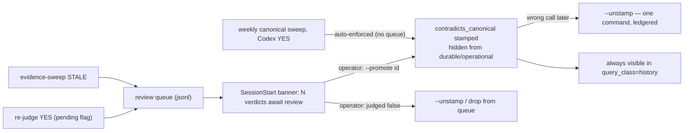

# Reconciliation — how a self-writing memory stays honest

Deep-dive on layer 5 of [`ARCHITECTURE.md`](../../ARCHITECTURE.md): the machinery that hunts stale and contradicting facts, the judges, the verdict semantics, and the queue-gated resolution policy — including the measured incidents that forced each design decision. This layer exists because the alternative is silent drift: a store that keeps confidently serving "the config lives at the old path" months after it moved.

## The three detectors

| Detector | Question | Anchors on | Cadence |
|---|---|---|---|
| Canonical contradiction sweep | "does candidate B contradict canonical A?" | every canonical fact | weekly timer (Sun 05:00) + on-demand |
| Evidence-vs-evidence supersession sweep | "should the OLDER of two near-duplicates be hidden as stale?" | most-recent non-canonical facts | on-demand (`--evidence-sweep`) |
| NLI write-gate (opt-in, async) | "does this brand-new record contradict canonical truth?" | each incoming write | at write time, post-response |

All three route judgment to **Codex through the Windows HTTP shim (:18792)** — clean JSON over loopback TCP, API-key-authed, prompts treating memory text as untrusted data inside delimiter blocks with closing-tag neutralization.

### Why local models never judge (measured, twice)

- An early local 3-B judge answered YES on **9/9** pairs spuriously; the later re-judge measured **78 % false positives** on local verdicts.
- The weekly systemd unit therefore judges with Codex — never local. Two distinct refusal mechanisms guard this: `--rejudge-stamped` **refuses outright** with a non-Codex judge (`refused:non-codex-judge` — a local verdict must never resolve flags), and any Codex-judged pass **no-ops when the shim is down** (`no-op:codex-shim-unreachable`) rather than silently falling back to a local judge. A deliberately local main-sweep pass still runs, but writes only advisory *pending* flags the gate ignores.

### Why there are two different judge questions (measured)

Contradiction and staleness are different questions, and conflating them flagged **valid history**: a live run of the evidence sweep using the generic "does B contradict A?" NLI prompt queued 30 pairs of which ~⅔ were legitimate historical ship-logs ("v0.29 shipped" vs "v0.29.5 shipped" — logically superseding, but *history*, not lies). The dedicated **supersession judge** asks the operational question instead:

> *"Would re-reading the OLDER memory today MISLEAD someone about the CURRENT state of the system?"* → `STALE` (a persistent current-state claim the newer fact falsifies: a moved path, a reversed conclusion, a cancelled service) or `KEEP` (a dated record of something that happened: ship-logs, milestones, plans, one-time measurements — *later progress does not falsify history*). Default on uncertainty: **KEEP**.

Measured on the 30 labeled pairs: precision **35 % → 67 % at 100 % genuine recall**. A higher similarity floor was evaluated as the alternative fix and **rejected with evidence** — the false pairs (near-identical ship-logs) are *more* cosine-similar than the genuine stale pairs, so any floor cuts real staleness before noise.

## Verdict semantics — two flags, one gate rule

| Flag on a record | Meaning | Enforced by the admission gate? |
|---|---|---|
| `contradicts_canonical_pending` | an **advisory** (historically local-judge) YES | **No — deliberately ignored.** A weak verdict must never hide a live record |
| `contradicts_canonical` | the **authoritative** stamp | Yes — hidden from durable/operational reads (forensic `history` still sees it) |

Every stamp travels through the trusted-actor mem0 PATCH path (key-allowlisted actor), never direct store writes — so the ledger and gate see every change.

## The resolution policy: auto-clear always; hides are queue-gated on two of three paths

The load-bearing asymmetry: **clearing a flag is safe and automated; hiding is dangerous and controlled.** The exact enforcement per path:

| Path | A YES/STALE verdict does |
|---|---|
| Re-judge of stamped/pending flags (`--rejudge-stamped`) | NO → **auto-clears** (17/17 correct on the motivating backlog); YES on an advisory-pending record → **review queue**, never enforced (unless the explicitly-named `--allow-auto-promote` danger flag is passed) |
| Evidence-vs-evidence sweep (`--evidence-sweep`) | STALE → **review queue only**; the sweep never mutates the store |
| **Weekly canonical sweep** (`--apply --judge codex`, the Sunday unit) | YES → **stamps `contradicts_canonical` directly — enforced, no queue** (with `--judge local` the same verdict writes only the advisory *pending* flag, which the gate ignores) |

So the honest statement is: *new evidence-vs-evidence hides and pending-flag promotions are always human-gated; the weekly canonical-anchored sweep auto-enforces authoritative Codex verdicts.* Recovery is uniform regardless of path: `--unstamp <id>` un-hides in one command, the forensic `history` class always sees hidden records, and the next re-judge auto-clears anything Codex no longer stands behind. The SessionStart banner surfaces the queue depth.

**The incident behind the queue:** an early auto-enforce pass over *pending* flags hid **3 out of 4 perfectly consistent facts** on single Codex YES verdicts (2026-06-30). The queue has gated that path — and all evidence-vs-evidence hides — since. Note the historical wrinkle: the weekly unit judged locally (advisory-only) until the C5 hardening switched it to Codex for verdict quality, which made the Sunday pass enforcement-capable again; if a Sunday stamp ever looks wrong, `--unstamp` + the re-judge are the designed recovery.

### Queue lifecycle

Queue writes are idempotent by memory id; sweeps and re-judges hold single-runner locks (atomic mkdir, stale-reclaim) so concurrent runs can't double-process.

## The NLI write-gate (poisoning defense at the door)

Env-gated (`MEM0_NLI_GATE_ENABLED`, default off) and **async** — it runs as a background task after the write's HTTP response, so the hot path never waits. Fast pre-filter first: a canonical-tier search at cosine ≥ 0.5, top-3; Codex is invoked only when a genuinely high-similarity canonical neighbor exists. **Fails open** on every uncertainty (empty text, no neighbor, search error, shim down, unparseable, NO) — only a confident contradiction flags. Combined with the extractor's redaction and the L10 injection-shaped heuristics, this is the anti-poisoning stack; the unforgeable canonical tier bounds the blast radius of anything that slips through.

## Operating it

Day-2 commands, banners, and the shim's availability model are in [`operations.md`](../operations.md#the-session-banner-says-contradictions-await-review). The short version: when the banner shows queued verdicts, read the queue, `--promote` the genuinely stale, ignore or clear the rest — queued items are never enforced without you (weekly-sweep stamps are the exception, and `--unstamp` reverses any of it in one command).

## Design principles of the layer (summary)

1. **Authoritative judgment only** — Codex or refuse to run; advisory flags are never enforced.
2. **Asymmetric automation** — un-hiding is always automated; hiding requires a human on the re-judge and evidence-sweep paths (the weekly canonical sweep auto-enforces Codex verdicts — recoverable via `--unstamp` + forensic visibility).
3. **Different questions, different judges** — contradiction ≠ staleness; each has its own calibrated prompt.
4. **Nothing is unrecoverable** — forensic class, `--unstamp`, append-only ledger.
5. **Every policy here is scar tissue** — the 78 % local-FP rate, the 9/9 spurious YES, the 3/4 auto-hide incident, and the ⅔ ship-log over-flagging are all *measured* failures the current design encodes.
