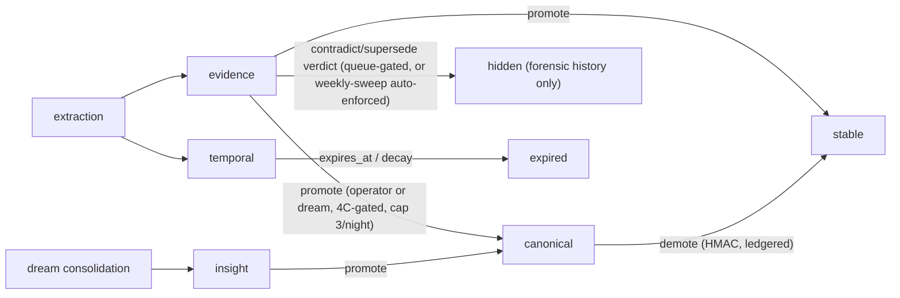

# The memory model — layers, tiers, classes, and the life of a memory

The deep-dive on **what the memory actually is**. [`ARCHITECTURE.md`](../../ARCHITECTURE.md) explains the machinery; this doc explains the *model* the machinery serves: the three axes every record lives on, what each layer is **for**, its full lifecycle, and the math that ages it.

A single stored memory is positioned on **three independent axes**:

| Axis | Question it answers | Values |
|---|---|---|
| **Memory type** | *What kind of knowledge is this?* | semantic fact, episode, goal, open question, insight |
| **Trust tier** | *How much should the agent believe it?* | `canonical` > `stable` > `insight` > `evidence` > `temporal` |
| **Query class** | *In what mode is it being asked for?* | `durable`, `operational`, `canonical`, `history` |

Confusions to avoid (they have caused real bugs): **"durable" is a query class, not a tier**; `insight` is a tier *and* a memory type; the admission gate is a *retrieval filter*, not an authorization layer (the same API key can read everything via the right class).

---

## Axis 1 — Trust tiers: purpose and lifecycle

The tier is the system's answer to the defining problem of a **self-writing** memory: an LLM extracted these facts from noisy conversations, so *how much should a future agent trust each one?* Tiers separate "an LLM once thought this" from "the operator locked this as ground truth."

### `evidence` — the workhorse (default tier)

- **Purpose:** everything auto-captured lands here first. It is deliberately *mid-trust*: retrievable and useful, but never authoritative — a future agent should verify an `evidence` fact before consequential action.
- **Written by:** the L1a extractor (session facts), MCP `memory_add`.
- **Lifecycle:** born at extraction → surfaced by durable/operational searches → candidates for **promotion** (dream nightly nomination → 4C gate → `canonical`) or **hiding** (superseded/contradicted via reconciliation) → **decays** on the durable path by Weibull half-life ~365 d (env-gated) and is flagged for review after 90 d without reinforcement (decay-scan).
- **Example:** `"llama-swap serves EmbeddingGemma on :11436; Ollama is decommissioned."`

### `temporal` — explicitly perishable (write-side parking)

- **Purpose:** facts with a shelf life ("the staging deploy is frozen this week"). Keeping them out of `evidence` prevents time-bound state from masquerading as durable knowledge.
- **Written by:** direct MCP/API `memory_add` with `tier=temporal` (+ optional `expires_at`). The L1a extractor never emits it — every auto-extracted fact posts as `evidence`.
- **Lifecycle — and an honest caveat:** in the current admission policies temporal is admitted by **no query class at all** — it is *write-side parking*: stored, ledgered, deleted by decay-scan once `expires_at` passes (the deletion is ledgered + reported, not silent), but invisible to every read path until a class admits it. Use it to record expiring state for the audit trail, not for retrieval.

### `insight` — consolidated knowledge (machine-written, machine-only)

- **Purpose:** higher-order patterns distilled *across* sessions by the nightly dream ("the operator prefers X across all repos", "errors of class Y always trace to Z"). One insight compresses many evidence records.
- **Written by:** **only** the consolidator actor (`ADD_ALLOWED_TIERS` blocks it for everyone else) — lineage-tracked to its source evidence.
- **Read:** admitted on durable/operational searches, but **filtered out of the per-prompt hot bundle server-side** — insights are for deliberate recall, not ambient injection.
- **Lifecycle:** no stored decay or expiry (operational reads recency-weight it like everything else); can be promoted to `canonical` like evidence.

### `stable` — settled durable facts

- **Purpose:** the promotion landing zone between machine-captured and operator-locked: durable, settled, not cryptographically protected.
- **Written by:** promotion only (`PATCH /tier`). No decay.

### `canonical` — locked ground truth

- **Purpose:** the facts everything else is judged against. The contradiction sweep uses canonical as its **anchor set**; the NLI write-gate flags new records that contradict it; agent guidance treats it as overriding.
- **Written by:** *no plain write can ever create it.* Two doors only: the operator's HMAC-signed CLI (`mem0-canonize.sh` — DPAPI-held key, burned nonce, mandatory reason), or the dream's autopromotion (≤ 3/night, confidence-sorted, deduped, through the **enforced 4C contradiction/corroboration gate**). Every change lands in the tier ledger.
- **Lifecycle:** no decay, no expiry. Only the `canonical` and `history` classes admit it — it does not ride ordinary durable searches and never appears in the per-prompt bundle; it arrives through the dedicated canonical-class channel of `memory_recall` (or an explicit `query_class="canonical"` search).
- **Example:** `"All LLM judgment routes to the Codex layer; the local models only embed and rerank."`

### Movement between tiers

Demotion exists (`memory_demote`) and is ledgered like promotion. Hiding is human-gated on the evidence-vs-evidence and re-judge paths, and auto-enforced only by the weekly canonical sweep's authoritative Codex verdicts — always reversible (`--unstamp`) and always forensic-visible; see [`reconciliation.md`](./reconciliation.md) for the exact per-path matrix.

---

## Axis 2 — Query classes: four ways to ask

The same store answers four different questions, each with its own admission policy (`admission_gate.py: default_policy_for_class`):

| Class | Tiers admitted | Age cap | Hides superseded/contradicted? | Use |
|---|---|---|---|---|
| `durable` (default) | stable, evidence, insight | none | yes | "what do we know about X" — knowledge ages well |
| `operational` | stable, evidence, insight | **180 d** | yes | "what's the current state of X" — operational notes go stale |
| `canonical` | stable, canonical | none | yes | explicit ground-truth pull |
| `history` | stable, evidence, insight, **canonical** | none | **no (forensic)** | audits: "what did we *used to* believe, and why did it change" |

`history` is the escape hatch that makes the hide machinery safe: nothing the reconciliation system does is unrecoverable, because the forensic class always sees hidden records (a v0.20 fix extended it to canonical — before that, a superseded canonical record was unreachable in *every* class).

---

## Axis 3 — Memory types: what kind of knowledge, and why each exists

The cognitive taxonomy, mapped to concrete machinery — each type exists because a coding agent fails in a specific way without it:

### Semantic memory (facts) — *the core*
**Failure it prevents:** re-deriving project facts every session (ports, paths, decisions, constraints).
**Implementation:** the tiered mem0 records above. **Write moment:** L1a extraction + MCP adds. **Read moment:** every retrieval channel.
**Shape rules** (enforced by the extraction prompt): atomic (one claim per record), self-contained, ≤ 60 words hard cap, proper nouns/numbers verbatim, procedures phrased as actionable rules (`IF rolling back the egemma migration THEN disable egemma-rollback-prune.timer FIRST`).

### Episodic memory (events) — *what happened*
**Failure it prevents:** losing session narrative ("we tried X two weeks ago and it failed — why?") that atomic facts can't carry.
**Implementation:** the `episodic.db` SQLite+FTS5 ledger — one **episode** per session (goal, summary, what advanced, what blocked), checkpointed in-progress on every prompt, finalized at session end; linked to the mem0 facts it produced (`episode_links`). Ship-log narratives that would pollute semantic memory are deliberately folded here instead.
**Read moment:** `episodic_*` MCP tools; the **raw-trace fallback** (when a durable search admits nothing, one relevant past-episode snippet may surface at raw cosine ≥ 0.20); the session-start précis anchor.

### Working memory (the current task)
**Implementation:** the per-prompt `[MEMORY CONTEXT]` block (top K = 1–2 gated memories + open goals/questions) + the in-progress episode checkpoint. Ephemeral by design — regenerated every prompt, never stored as such.

### Prospective memory (intentions)
**Failure it prevents:** goals silently dying at session boundaries.
**Implementation:** the goals tree (adjacency-list hierarchy, FTS5, dedup by fuzzy title) + open questions, extracted per session (0–3 advanced goals, 0–2 blocked, 0–5 open questions raised) and surfaced at session start and in the bundle. Stale goals get swept weekly.

### Consolidated memory / "insights"
**Failure it prevents:** patterns spread across 30 sessions that no single session's facts express.
**Implementation:** the `insight` tier — the dream's surprise-weighted synthesis (corrections, decisions, surprises, contradictions carry the most signal — an Information-Gain heuristic).

### Correction memory (real-time)
**Failure it prevents:** an operator correction ("no — always X, never Y") depending on the nightly cycle to become durable.
**Implementation:** `Test-CorrectionLikePrompt` on the per-prompt path appends correction-shaped prompts to `~/.mem0/learn-rules.jsonl` the moment they happen. Today the queue's pending lines act as *debt* that triggers the dream catch-up; draining the queue into durable rules is designed-but-unimplemented (the capture side ships first so no correction is ever lost).

### What is deliberately thin
**Procedural memory** (executable how-to) — how-to *lessons* store as semantic IF/THEN facts, but executable procedures belong to Claude Code skills, not this store. **Associative memory** — entity boosts in hybrid search only. These are scope decisions, not gaps: the store optimizes for *trustworthy declarative recall*.

---

## Freshness: the decay math

`freshness.py`: `w = exp(−ln2 · (age_days/η)^κ)` — η is the half-life (w(η) = 0.5 for any κ), κ the shape (κ = 1 plain exponential; κ > 1 = a steeper "anti-staleness cliff"; κ < 1 = heavier tail).

| Path | What decays | η default | Effect |
|---|---|---|---|
| operational reads | **all** admitted results | 30 d (`MEM0_OPERATIONAL_HALF_LIFE_DAYS`) | a 30-day-old operational note ranks at half weight |
| durable reads (env-gated, default off) | **only `evidence`** (`DURABLE_DECAY_TIERS`) | 365 d | a 30-day-old evidence fact keeps ≈ 0.945 of its score; a year-old one, half |
| decay-scan (weekly) | `temporal` expiry; `evidence` > 90 d flagged | — | expired temporal is deleted (ledgered + reported); old evidence is only flagged for review |

Canonical, stable, and insight have **no stored decay and no expiry** — atemporal knowledge shouldn't age out; staleness for them is handled by *reconciliation*, not time. (Nuance: the *operational* class recency-weights **every** result it returns, whatever the tier — per-query ranking, not stored decay.)

---

## The life of a memory — a worked example

1. **Born.** You tell the agent the staging DB moved to a new host. Session ends → L1a reads the last 24 turns, redacts secrets, and the inferability gate keeps `"Staging Postgres moved to host X on 2026-07-01"` → `POST /v1/memories`, `tier=evidence`. The episode records *why* it moved; a goal "migrate the staging consumers" is registered.
2. **Working.** Next session you ask about staging: the fact clears the 0.30 gate, rides the `[MEMORY CONTEXT]` block at the recency peak above your prompt.
3. **Challenged.** A month later the DB moves again; a new evidence fact lands. An **evidence-vs-evidence sweep** (on-demand — the weekly cron runs the canonical-anchored sweep) finds the old fact as a near-duplicate older neighbor, and the supersession judge answers its acid test — *"would re-reading the older fact mislead about the CURRENT state?"* — **STALE** → queued to the human review file, surfaced in your session banner.
4. **Hidden — by you.** `--promote` stamps it; the admission gate now drops it from durable/operational reads. It is still fully visible via `query_class="history"` and in the tier ledger. (`--unstamp` reverses in one command.)
5. **Or elevated.** Had it instead been reinforced and nominated by the dream (confidence-sorted, top-3, deduped, past the 4C gate), it would have been HMAC-promoted to `canonical` — becoming part of the anchor set future facts are judged against.

That loop — *capture with skepticism, trust in graded tiers, decay the perishable, reconcile the contradictory, and never hide anything without a human* — **is** the memory model.
