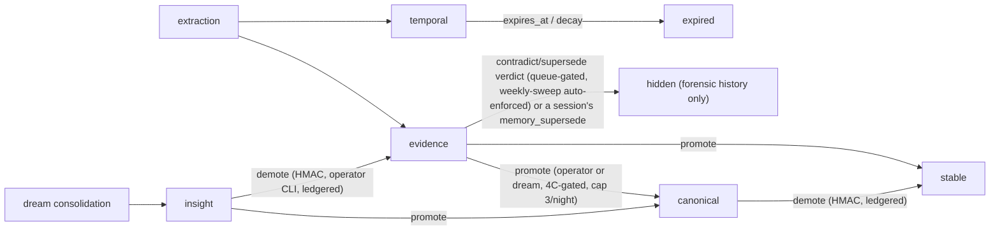

# The memory model — layers, tiers, classes, and the life of a memory

## Purpose

The deep-dive on **what the memory actually is**. [`ARCHITECTURE.md`](../../ARCHITECTURE.md) explains the machinery; this doc explains the *model* the machinery serves: the three axes every record lives on, what each layer is **for**, its full lifecycle, and the math that ages it.

## Questions this doc answers

- What are the three independent axes a stored memory lives on (type, trust tier, query class)?
- What is each trust tier *for*, who may write it, and how does it age?
- Which query class admits which tiers, and why does `history` see everything?
- Which cognitive memory types does the store implement, and which are deliberately thin?
- How does freshness/decay actually work, and which tiers never decay?
- What does the full lifecycle of one memory look like, from capture to canonical or hidden?

## Scope

The conceptual model of a single stored memory: the three axes, the per-tier purpose and lifecycle, the query-class admission policies, the cognitive memory-type taxonomy, the freshness/decay math, and the end-to-end life of a memory.

## Non-scope

The concrete REST/MCP interfaces, endpoint mechanics, and status codes belong to [`mem0-api.md`](./mem0-api.md); the exact per-path reconciliation matrix to [`reconciliation.md`](./reconciliation.md); the admission-policy implementation to [`admission-gate.md`](./admission-gate.md). What the store *deliberately does not* model:

**Procedural memory** (executable how-to) — how-to *lessons* store as semantic IF/THEN facts, but executable procedures belong to Claude Code skills, not this store. **Associative memory** — entity boosts in hybrid search only. These are scope decisions, not gaps: the store optimizes for *trustworthy declarative recall*.

## Key concepts

A single stored memory is positioned on **three independent axes**:

| Axis | Question it answers | Values |
|---|---|---|
| **Memory type** | *What kind of knowledge is this?* | semantic fact, episode, goal, open question, insight |
| **Trust tier** | *How much should the agent believe it?* | `canonical` > `stable` > `insight` > `evidence` > `temporal` |
| **Query class** | *In what mode is it being asked for?* | `durable`, `operational`, `canonical`, `history` |

Confusions to avoid (they have caused real bugs) are collected under [Common pitfalls](#common-pitfalls).

## How the system works

### Axis 1 — Trust tiers: purpose and lifecycle

The tier is the system's answer to the defining problem of a **self-writing** memory: an LLM extracted these facts from noisy conversations, so *how much should a future agent trust each one?* Tiers separate "an LLM once thought this" from "the operator locked this as ground truth."

#### `evidence` — the workhorse (default tier)

- **Purpose:** everything auto-captured lands here first. It is deliberately *mid-trust*: retrievable and useful, but never authoritative — a future agent should verify an `evidence` fact before consequential action.
- **Written by:** the L1a extractor (session facts), MCP `memory_add`.
- **Lifecycle:** born at extraction → surfaced by durable/operational searches → candidates for **promotion** (dream nightly nomination → 4C gate → `canonical`) or **hiding** (superseded/contradicted via reconciliation, or retired by a session's own `memory_supersede`) → **decays** on the durable path by Weibull half-life ~365 d (env-gated) and is flagged for review after 90 d without reinforcement (decay-scan).
- **Example:** `"llama-swap serves EmbeddingGemma on :11436; Ollama is decommissioned."`

#### `temporal` — explicitly perishable (write-side parking)

- **Purpose:** facts with a shelf life ("the staging deploy is frozen this week"). Keeping them out of `evidence` prevents time-bound state from masquerading as durable knowledge.
- **Written by:** direct MCP/API `memory_add` with `tier=temporal`. The L1a extractor never emits it — every auto-extracted fact posts as `evidence`.
- **`expires_at` CANNOT be set at write time.** It sits in `_ADD_FORBIDDEN_META` (`app.py`), so `add()`
  **silently strips** it and still returns `200` — the caller believes it set an expiry and did not. The only
  writer is `PATCH /v1/memories/{id}/metadata` by a server-side job label (`decay-scan` or `system`), i.e. after the fact, and since 1.32.5 the server accepts that label only on a request that carries the authority's service key.
  There is no `valid_until` field at all ([tier policy](./tier-policy.md)).
  Verified live 2026-08-11: an add carrying `expires_at` returned `200` with the key absent from the stored
  payload.
- **Consequence — decay-scan's expiry arm has never fired.** `decay-scan.py` hard-deletes `tier=temporal`
  records whose `expires_at` has passed, but nothing writes that field, so the arm is inert *by
  construction*. Treat decay-scan as a ONE-armed job: its surviving arm only **flags**, and nothing
  consumes `decay-report.jsonl` yet. Temporal is parking with **no automatic expiry** — records sit
  indefinitely unless something PATCHes an expiry onto them.
- **Lifecycle — and an honest caveat:** in the current admission policies temporal is admitted by **no query class at all** — it is *write-side parking*: stored and ledgered, but invisible to every read path until a class admits it. Use it to record expiring state for the audit trail, not for retrieval.

#### `insight` — consolidated knowledge (machine-written, machine-only)

- **Purpose:** higher-order patterns distilled *across* sessions by the nightly dream ("the operator prefers X across all repos", "errors of class Y always trace to Z"). One insight compresses many evidence records.
- **Written by:** **only** the authority's nightly dream, whose consolidator label counts only on a request that carries the authority's service key (1.32.5; `ADD_ALLOWED_TIERS` blocks it for everyone else) — lineage-tracked to its source evidence. **No MCP session can create or move an insight record:** `memory_add` with `tier=insight` is always downgraded to `evidence` (before 1.32.5 a session that typed a consolidator `source` got through), and `memory_promote` / `memory_demote` cannot move an insight in either direction.
- **Read:** admitted on durable/operational searches, but **filtered out of the per-prompt hot bundle server-side** — insights are for deliberate recall, not ambient injection.
- **Lifecycle:** no stored decay or expiry (operational reads recency-weight it like everything else); can be promoted to `canonical` like evidence. It leaves the tier only on the operator's signed token, like `canonical` (`mem0-canonize.sh --action demote`, or a signed delete); no job label exempts it, because nothing in the stack demotes an insight.

#### `stable` — settled durable facts

- **Purpose:** the promotion landing zone between machine-captured and operator-locked: durable, settled, not cryptographically protected.
- **Written by:** promotion only (`PATCH /tier`). No decay.

#### `canonical` — locked ground truth

- **Purpose:** the facts everything else is judged against. The contradiction sweep uses canonical as its **anchor set**; the NLI write-gate flags new records that contradict it; agent guidance treats it as overriding.
- **Written by:** *no plain write can ever create it.* Two doors only: the operator's HMAC-signed CLI (`mem0-canonize.sh` — HMAC signing key, burned nonce, mandatory reason), or the dream's autopromotion (≤ 3/night, confidence-sorted, deduped, through the **4C contradiction/corroboration gate** — which ships in shadow-calibration mode by default; enforce is opt-in). Every change lands in the tier ledger.
- **Lifecycle:** no decay, no expiry. Only the `canonical` and `history` classes admit it — it does not ride ordinary durable searches and never appears in the per-prompt bundle; it arrives through the dedicated canonical-class channel of `memory_recall` (or an explicit `query_class="canonical"` search).
- **Example:** `"All LLM judgment routes to the Codex layer; the local models only embed and rerank."`

### Axis 2 — Query classes: four ways to ask

The same store answers four different questions, each with its own admission policy (`admission_gate.py: default_policy_for_class`):

| Class | Tiers admitted | Age cap | Hides superseded/contradicted? | Use |
|---|---|---|---|---|
| `durable` (default) | stable, evidence, insight | none | yes | "what do we know about X" — knowledge ages well |
| `operational` | stable, evidence, insight | **180 d** | yes | "what's the current state of X" — operational notes go stale |
| `canonical` | stable, canonical | none | yes | explicit ground-truth pull |
| `history` | stable, evidence, insight, **canonical** | none | **no (forensic)** | audits: "what did we *used to* believe, and why did it change" |

`history` is the escape hatch that makes the hide machinery safe: nothing the reconciliation system does is unrecoverable, because the forensic class always sees hidden records (a v0.20 fix extended it to canonical — before that, a superseded canonical record was unreachable in *every* class).

### Axis 3 — Memory types: what kind of knowledge, and why each exists

The cognitive taxonomy, mapped to concrete machinery — each type exists because a coding agent fails in a specific way without it:

#### Semantic memory (facts) — *the core*
**Failure it prevents:** re-deriving project facts every session (ports, paths, decisions, constraints).
**Implementation:** the tiered mem0 records above. **Write moment:** L1a extraction + MCP adds. **Read moment:** every retrieval channel.
**Shape rules** (enforced by the extraction prompt): atomic (one claim per record), self-contained, ≤ 60 words hard cap, proper nouns/numbers verbatim, procedures phrased as actionable rules (`IF rolling back the egemma migration THEN disable egemma-rollback-prune.timer FIRST`).

#### Episodic memory (events) — *what happened*
**Failure it prevents:** losing session narrative ("we tried X two weeks ago and it failed — why?") that atomic facts can't carry.
**Implementation:** the `episodic.db` SQLite+FTS5 ledger — one **episode** per session (goal, summary, what advanced, what blocked), checkpointed in-progress on every prompt (its running summary holds only what the person typed: a task notification or a message relayed from another agent session still counts as a checkpoint but adds no text), finalized at session end; linked to the mem0 facts it produced (`episode_links`). Ship-log narratives that would pollute semantic memory are deliberately folded here instead.
**Read moment:** `episodic_*` MCP tools; the **raw-trace fallback** (when a durable search admits nothing, one relevant past-episode snippet may surface at raw cosine ≥ 0.20); the session-start précis anchor.

#### Working memory (the current task)
**Implementation:** the per-prompt `[MEMORY CONTEXT]` block (top K = 1–2 gated memories + open goals/questions) + the in-progress episode checkpoint. Ephemeral by design — regenerated every prompt, never stored as such.

#### Prospective memory (intentions)
**Failure it prevents:** goals silently dying at session boundaries.
**Implementation:** the goals tree (adjacency-list hierarchy, FTS5, dedup by fuzzy title) + open questions, extracted per session (0–3 advanced goals, 0–2 blocked, 0–5 open questions raised) and surfaced at session start and in the bundle. Stale goals get swept weekly.

#### Consolidated memory / "insights"
**Failure it prevents:** patterns spread across 30 sessions that no single session's facts express.
**Implementation:** the `insight` tier — the dream's surprise-weighted synthesis (corrections, decisions, surprises, contradictions carry the most signal — an Information-Gain heuristic).

#### Correction memory (real-time)
**Failure it prevents:** an operator correction ("no — always X, never Y") depending on the nightly cycle to become durable.
**Implementation:** `Test-CorrectionLikePrompt` on the per-prompt path appends correction-shaped prompts to `~/.mem0/learn-rules.jsonl` the moment they happen, redacted with the shared `Redact-Secrets` rules at write time. `learn-rules-drain.ps1` (spawned by `memory-maintenance-spawn.ps1` at SessionStart on **every** role, throttled to once an hour) then posts each pending correction to the authority as an evidence-tier memory (`infer` off, `source=learn-rules`, `kind=correction`, with the capture time, session id and brand) and stamps the line `drained` with the returned memory id. It is a queue of *evidence*, not of rules: a correction reaches the store within an hour of a session start on that PC, and promotion above evidence stays with the dream and the operator. Test-failure lines (an older hook wrote them here) are stamped `dropped` and never posted; a deterministic 4xx marks a line `rejected`; an unreachable authority or a 5xx leaves every line `pending` for the next run. A failed queue swap after successful POSTs cannot cause a re-post: the accepted lines are journaled to `learn-rules.jsonl.pending-commit` and applied by the next run. At most 50 corrections are posted per run, and finished lines are pruned after 30 days. The pending lines are **not** dream debt any more: `dream-catchup.ps1` no longer counts them. `Test-MemoryStack` warns when a pending correction is older than 48 h, which means the drain is not running or cannot reach the authority.

### Freshness: the decay math

`freshness.py`: `w = exp(−ln2 · (age_days/η)^κ)` — η is the half-life (w(η) = 0.5 for any κ), κ the shape (κ = 1 plain exponential; κ > 1 = a steeper "anti-staleness cliff"; κ < 1 = heavier tail).

| Path | What decays | η default | Effect |
|---|---|---|---|
| operational reads | **all** admitted results | 30 d (`MEM0_OPERATIONAL_HALF_LIFE_DAYS`) | a 30-day-old operational note ranks at half weight |
| durable reads (env-gated, default off) | **only `evidence`** (`DURABLE_DECAY_TIERS`) | 365 d | a 30-day-old evidence fact keeps ≈ 0.945 of its score; a year-old one, half |
| decay-scan (weekly) | `temporal` expiry; `evidence` > 90 d flagged | — | expired temporal is deleted (ledgered + reported); old evidence is only flagged for review |

Canonical, stable, and insight have **no stored decay and no expiry** — atemporal knowledge shouldn't age out; staleness for them is handled by *reconciliation*, not time. (Nuance: the *operational* class recency-weights **every** result it returns, whatever the tier — per-query ranking, not stored decay.)

## Important flows

### Movement between tiers

```mermaid
flowchart LR
    X["extraction"] --> E[evidence]
    X --> T[temporal]
    D["dream consolidation"] --> I[insight]
    E -->|"promote (operator or dream, 4C-gated, cap 3/night)"| C[canonical]
    E -->|promote| S[stable]
    I -->|promote| C
    I -->|"demote (HMAC, operator CLI, ledgered)"| E
    C -->|"demote (HMAC, ledgered)"| S
    E -->|"contradict/supersede verdict (queue-gated, weekly-sweep auto-enforced) or a session's memory_supersede"| H["hidden (forensic history only)"]
    T -->|"expires_at / decay"| G["expired"]
```

Demotion exists and is ledgered like promotion: `memory_demote` moves evidence, stable and temporal records, while a move out of `canonical` or `insight` needs the operator's signed token (`mem0-canonize.sh --action demote`). Hiding is human-gated on the evidence-vs-evidence and re-judge paths, and auto-enforced only by the weekly canonical sweep's authoritative Codex verdicts — always reversible (`--unstamp`) and always forensic-visible; see [`reconciliation.md`](./reconciliation.md) for the exact per-path matrix.

**Superseding (1.32.4).** A session that learns a fact is stale retires it itself: `memory_supersede(old, new)` records that the newer memory replaces the whole older one (`superseded_by`; the admission gate then withholds the old record outside the `history` class), and `scope="partial"` with a `detail` annotates one stale claim in a record that otherwise stands (`partially_superseded_by`, which never hides). The server enforces the refusals whoever calls: a `canonical`, `insight` or tier-less record is never superseded this way (a canonical leaves default retrieval only through the operator's signed demote), and a retired record or winner, a winner that is itself superseded, a different user's or brand's winner and a second winner are refused. Every supersession is ledgered and reversible (`memory_unsupersede`, `contradiction-sweep.py --unsupersede`). Appending `SUPERSEDED ... by <id>` to a record's text does nothing: the gate reads the field, never the text. See [`reconciliation.md`](./reconciliation.md) and [api-contracts](../api-contracts.md).

### The life of a memory — a worked example

1. **Born.** You tell the agent the staging DB moved to a new host. Session ends → L1a reads the last 24 turns, redacts secrets, and the inferability gate keeps `"Staging Postgres moved to host X on 2026-07-01"` → `POST /v1/memories`, `tier=evidence`. The episode records *why* it moved; a goal "migrate the staging consumers" is registered.
2. **Working.** Next session you ask about staging: the fact clears the 0.30 gate, rides the `[MEMORY CONTEXT]` block at the recency peak above your prompt.
3. **Challenged.** A month later the DB moves again; a new evidence fact lands. An **evidence-vs-evidence sweep** (on-demand — the weekly cron runs the canonical-anchored sweep) finds the old fact as a near-duplicate older neighbor, and the supersession judge answers its acid test — *"would re-reading the older fact mislead about the CURRENT state?"* — **STALE** → queued to the human review file, surfaced in your session banner.
4. **Hidden — by you.** `--promote` stamps it; the admission gate now drops it from durable/operational reads. It is still fully visible via `query_class="history"` and in the tier ledger. (`--unstamp` reverses in one command.) The stamp is a server-side job label the server accepts only with the authority's service key (1.32.5), so on the native authority a hand run goes through `bash ~/apps/mem0-scripts/ams-service-run.sh contradiction-sweep.py --promote <id>` (or `--unstamp <id>`); no session or PC holding only the API key can write it.
5. **Or elevated.** Had it instead been reinforced and nominated by the dream (confidence-sorted, top-3, deduped, past the 4C gate), it would have been HMAC-promoted to `canonical` — becoming part of the anchor set future facts are judged against.

That loop — *capture with skepticism, trust in graded tiers, decay the perishable, reconcile the contradictory, and never hide anything without a human* — **is** the memory model.

## Data and state

The model is realized by concrete stores, documented in their own system docs: the mem0 Qdrant collection `mem0_egemma_768` (768-dim EmbeddingGemma vectors; tier lives in each point's payload); the append-only tier ledger (`~/.mem0/tier-ledger-YYYY-MM.jsonl`) that records every promotion/demotion/hide; the `episodic.db` SQLite+FTS5 ledger for episodes, goals, and open questions; and the dream-rebuilt `~/.mem0/MEMORY.md` lean index. See [`mem0-api.md`](./mem0-api.md) and [`episodic.md`](./episodic.md) for the concrete schemas.

## Interfaces and entry points

This is a conceptual model, not a running service — it has no interfaces of its own. Its axes are enforced at the read/write boundaries documented in [`mem0-api.md`](./mem0-api.md) (REST + MCP), [`admission-gate.md`](./admission-gate.md) (query classes), and [`reconciliation.md`](./reconciliation.md) (hiding/supersession).

## Dependencies

- The EmbeddingGemma embedder + Qdrant that make records retrievable (see [`llama-swap-binding.md`](./llama-swap-binding.md)).
- `admission_gate.py` for the per-class tier admission policy.
- `freshness.py` for the Weibull decay weighting.
- The reconciliation subsystem for supersession/contradiction hiding.

## Downstream effects

Changing any tier's semantics, a query class's admitted-tier set, or the decay parameters ripples into every retrieval channel: the per-prompt `[MEMORY CONTEXT]` injection, `memory_recall`, the admission gate, and the reconciliation sweeps. Tier names and the promotion rules are also mirrored in [`tier-policy.md`](./tier-policy.md) and the [glossary](../glossary.md) — keep them in sync.

## Invariants and assumptions

- `canonical` is the anchor set every other record is judged against; **no plain write can create it** — only the HMAC-signed CLI or the 4C-gated dream autopromotion.
- `insight` is machine-written: only the authority's dream, proven by the service key, or the operator's signed token writes, rewrites or deletes one, and only the signed token moves one out of the tier. An actor or `source` string is a label, never a credential.
- Nothing is ever hidden without a forensic escape hatch: the `history` class always sees superseded/contradicted (and, since v0.20, canonical) records; every hide is reversible (`--unstamp`, `--unsupersede`, `memory_unsupersede`) and ledgered.
- Each semantic record is atomic — one claim per record — so it stands alone when retrieved individually.
- `temporal` is admitted by no query class today; it is write-side parking, not a retrieval tier.

## Error handling

Not applicable at the model level — failure modes live in the systems that implement it (admission-gate, reconciliation, mem0-api). The model's one safety property is that every destructive transition (hide, demote, decay-delete) is ledgered and reversible, so an incorrect verdict is always recoverable.

## Security and privacy notes

Two credentials sit above the shared API key every PC and MCP session holds. The `canonical` tier needs the operator's HMAC-signed user-direct token to create, change or leave (the `dream-autopromote` actor still signs it). The server-side job labels (the dream's insight writes, the sweep's hide stamps, `retired_at`, `retrievable`, `expires_at`) count only on a request that carries the authority-only **service key** (1.32.5), so the plain API key cannot hide a non-canonical record, schedule its deletion or mint an insight; the `insight` tier is gated by that key or the signed token, and leaving it needs the signed token. The service key separates the authority's own jobs from callers holding only the API key; it does not resist a shell on the authority as the service user, an ssh session to the brain, or (WSL brain) a Windows-side process of the same user, and it is one key for every job. [`tier-policy.md`](./tier-policy.md) has the threat model and the known gaps. The admission gate is a **retrieval filter, not an authorization layer** — the same API key can read every tier via the right query class; tier is about *trust and staleness*, not access control.

## Observability and debugging

The tier ledger (`~/.mem0/tier-ledger-YYYY-MM.jsonl`) is the audit trail for every tier movement; the dream-rebuilt `~/.mem0/MEMORY.md` gives a lean at-a-glance tier census; decay-scan writes a report of what it expired or flagged. `query_class="history"` is the debugging lens for "why is this record no longer retrieved." When the dream's insight writes or the sweep's stamps are refused, check `/health/deep`: `checks.service_key.present` (the capability `service-key`, required on the brain) says whether the authority loaded the service key, and without it every job label is refused with `403 service-credential-required`.

## Testing notes

The tier/admission behaviors are exercised by the mem0-server test suite (brand isolation, admission policy, tier enforcement) and by `freshness.py`'s unit tests for the Weibull curve. Validate a model change by running a durable/operational/canonical/history search over a seeded record set and confirming the admitted tiers match the table above.

## Common pitfalls

Confusions that have caused real bugs:

- **"durable" is a query class, not a tier.** It selects *how* you ask, not *what* a record is.
- **`insight` is a tier *and* a memory type.** The tier controls trust/admission; the type describes what kind of knowledge it is.
- **The admission gate is a *retrieval filter*, not an authorization layer.** The same API key can read everything via the right class.
- **An actor or `source` string is a label, not a credential.** Before 1.32.5 the server trusted the consolidator, sweep and job labels typed with the shared API key; now a privileged label counts only with the authority's service key (`403 service-credential-required` otherwise).
- **`temporal` is invisible to reads.** It is admitted by no query class today — do not use it to store something you expect to retrieve.

## Source map

- [`../../mem0-server/admission_gate.py`](../../mem0-server/admission_gate.py) — per-query-class tier admission policy.
- [`../../mem0-server/freshness.py`](../../mem0-server/freshness.py) — the Weibull freshness/decay weight.
- [`../../mem0-server/app.py`](../../mem0-server/app.py) — tier constants (`ADD_ALLOWED_TIERS`, `CANONICAL_AUTOPROMOTE_ALLOWED`) and the tier ledger writer.
- [`../../mem0-server/security_invariants.py`](../../mem0-server/security_invariants.py) — `INSIGHT_ALLOWED_ACTORS`, the job-label tables, the tier-write policy functions and the service-credential gate (`require_service_credential`).
- [`../../scripts/wsl/semantic-dedup.py`](../../scripts/wsl/semantic-dedup.py) — tier-sensitive dedup thresholds.
- [`../../mem0-server/episodic.py`](../../mem0-server/episodic.py) — the episodic/goals/open-questions ledger.

## Related docs

- [`tier-policy.md`](./tier-policy.md) — the full tier rule table.
- [`admission-gate.md`](./admission-gate.md) — query-class admission implementation.
- [`reconciliation.md`](./reconciliation.md) — supersession/contradiction hiding, the per-path matrix.
- [`mem0-api.md`](./mem0-api.md) — the concrete REST + MCP interfaces.
- [`dream-skill.md`](./dream-skill.md) — the nightly consolidator that writes insights and autopromotes to canonical.
- [`../flows/memory-capture.md`](../flows/memory-capture.md) · [`../flows/memory-retrieval.md`](../flows/memory-retrieval.md) — the end-to-end capture and retrieval flows.
- [`../glossary.md`](../glossary.md) — Tier, Canonical, Evidence, Insight, Query Class definitions.
- [`../../ARCHITECTURE.md`](../../ARCHITECTURE.md) — the machinery the model runs on.
