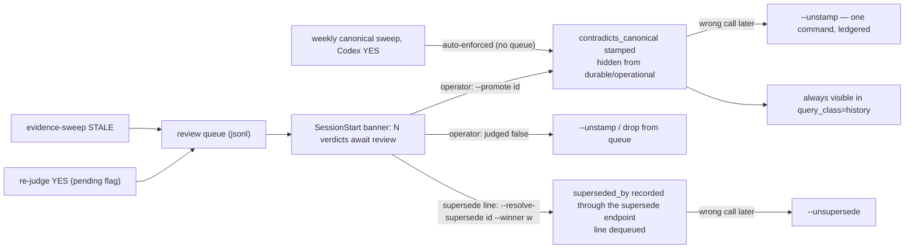

# Reconciliation — how a self-writing memory stays honest

Deep-dive on layer 5 of [`ARCHITECTURE.md`](../../ARCHITECTURE.md): the machinery that hunts stale and contradicting facts, the judges, the verdict semantics, and the queue-gated resolution policy — including the measured incidents that forced each design decision. This layer exists because the alternative is silent drift: a store that keeps confidently serving "the config lives at the old path" months after it moved.

## The three detectors

| Detector | Question | Anchors on | Cadence |
|---|---|---|---|
| Canonical contradiction sweep | "does candidate B contradict canonical A?" | every canonical fact | weekly timer (Sun 05:00) + on-demand |
| Evidence-vs-evidence supersession sweep | "should the OLDER of two near-duplicates be hidden as stale?" | most-recent non-canonical facts | on-demand (`--evidence-sweep`) |
| NLI write-gate (opt-in, async) | "does this brand-new record contradict canonical truth?" | each incoming write | at write time, post-response |

All three route judgment to **Codex through the Windows HTTP shim (:18792)** — clean JSON over loopback TCP, API-key-authed, prompts treating memory text as untrusted data inside delimiter blocks with closing-tag neutralization.

### Why local models never judge (measured, twice)

- An early local 3-B judge answered YES on **9/9** pairs spuriously; the later re-judge measured **78 % false positives** on local verdicts.
- The weekly systemd unit therefore judges with Codex — never local. Two distinct refusal mechanisms guard this: `--rejudge-stamped` **refuses outright** with a non-Codex judge (`refused:non-codex-judge` — a local verdict must never resolve flags), and any Codex-judged pass **no-ops when the shim is down** (`no-op:codex-shim-unreachable`) rather than silently falling back to a local judge. A deliberately local main-sweep pass still runs, but writes only advisory *pending* flags the gate ignores.

### Why there are two different judge questions (measured)

Contradiction and staleness are different questions, and conflating them flagged **valid history**: a live run of the evidence sweep using the generic "does B contradict A?" NLI prompt queued 30 pairs of which ~⅔ were legitimate historical ship-logs ("v0.29 shipped" vs "v0.29.5 shipped" — logically superseding, but *history*, not lies). The dedicated **supersession judge** asks the operational question instead:

> *"Would re-reading the OLDER memory today MISLEAD someone about the CURRENT state of the system?"* → `STALE` (a persistent current-state claim the newer fact falsifies: a moved path, a reversed conclusion, a cancelled service) or `KEEP` (a dated record of something that happened: ship-logs, milestones, plans, one-time measurements — *later progress does not falsify history*). Default on uncertainty: **KEEP**.

Measured on the 30 labeled pairs: precision **35 % → 67 % at 100 % genuine recall**. A higher similarity floor was evaluated as the alternative fix and **rejected with evidence** — the false pairs (near-identical ship-logs) are *more* cosine-similar than the genuine stale pairs, so any floor cuts real staleness before noise.

## Verdict semantics — two flags, one gate rule

| Flag on a record | Meaning | Enforced by the admission gate? |
|---|---|---|
| `contradicts_canonical_pending` | an **advisory** (historically local-judge) YES | **No — deliberately ignored.** A weak verdict must never hide a live record |
| `contradicts_canonical` | the **authoritative** stamp | Yes — hidden from durable/operational reads (forensic `history` still sees it) |

Every contradiction stamp travels through the trusted-actor mem0 PATCH path (key-allowlisted actor), never direct store writes — so the ledger and gate see every change. A *supersession* is the one lifecycle write with its own door instead (below): it is not a stamp any PATCH actor can write.

## The resolution policy: auto-clear always; hides are queue-gated on two of three paths

The load-bearing asymmetry: **clearing a flag is safe and automated; hiding is dangerous and controlled.** The exact enforcement per path:

| Path | A YES/STALE verdict does |
|---|---|
| Re-judge of stamped/pending flags (`--rejudge-stamped`) | NO → **auto-clears** (17/17 correct on the motivating backlog); YES on an advisory-pending record → **review queue**, never enforced (unless the explicitly-named `--allow-auto-promote` danger flag is passed) |
| Evidence-vs-evidence sweep (`--evidence-sweep`) | STALE → **review queue only**; the sweep never mutates the store |
| **Weekly canonical sweep** (`--apply --judge codex`, the Sunday unit) | YES → **stamps `contradicts_canonical` directly — enforced, no queue** (with `--judge local` the same verdict writes only the advisory *pending* flag, which the gate ignores) |

**Coverage, direction and the brain-side re-judge (WP-4).** Three properties of the weekly canonical sweep that used to be missing:

- *Rotation.* `--limit` is a rotating budget. `--user-id` defaults to the corpus tenant (`ams_env.user_id()`, `--user-id ""` = every user), canonicals are processed **never-checked first, then longest-unchecked** (`contradiction_checked_at`), and the sweep writes that marker back onto every canonical it finishes (trusted-actor PATCH, allowed on a canonical) - without the write the order would never advance. A canonical whose candidate query failed is left unmarked and keeps its place at the front, and in a real run a canonical counts as checked only when its marker write landed. The summary line reports `canonicals_checked`, `canonical_total` and `weeks_for_full_pass` (null when no marker landed), plus `marker_written` / `marker_failed` (any failed marker write reads `degraded:marker-failed:<n>`, because a canonical whose marker never lands is re-taken at the head of every week's rotation) and `skipped_no_vector` (a run where every canonical lacks a dense vector reads `degraded:no-vectors`). Zero canonicals under the *defaulted* tenant reads `degraded:zero-canonicals-defaulted-tenant` (a wrong tenant scopes to nothing); an explicit `--user-id` keeps `no-op:zero-canonicals`.
- *Outcome line (the step receipt).* Under the chain the sweep writes ONE line to `AMS_OUTCOME_FILE`, `<status>[:<reason>] <counts json>`, which `ams-step.sh` turns into the receipt's `status`, note and `work`. Every terminal path writes its status (the summary log is the choke point) and the end of each leg adds the counts. The status is the run's own outcome in the chain's grammar: `ok`; a `no-op:<reason>` (the Codex shim is down, a lock is held, zero canonicals, every pair skipped: exit 0 by design, but nothing was judged) reads `degraded:no-op-<reason>` and never `ok`; a `degraded:*` (for example `marker-failed:<n>`) exits non-zero and reads `degraded:<reason>`, which the receipt records as `failed` together with the counts; a `fatal:*` reads `failed:<reason>`. The sweep's counts are `canonicals_checked`, `canonicals_total`, `pairs` and `yes` (how much of the canonical set this run really covered, since `--limit` is a budget) plus `weeks_for_full_pass`, `marker_written`, `marker_failed`, `skipped_no_vector`, `stale_canonical_routed` and `stale_review_pruned`. The Sunday unit's second pass (the stamped re-judge) reports into the same line: its counts are added beside the sweep's with a `rejudge_` prefix (`rejudge_stamped_found`, `rejudge_checked`, `rejudge_yes`, `rejudge_no`, `rejudge_cleared`), and it can neither replace the sweep pass's reason nor turn a degraded sweep into an `ok` receipt.
- *Direction.* A YES whose candidate is **newer than the canonical** may be the correction, with the canonical the stale one. It is routed to the review queue as `kind: canonical-possibly-stale` (with `stale_canonical_id`, deliberately not `canonical_id`, so `--promote` cannot act on it) and the candidate gets only the `contradiction_checked_at` marker; nothing is hidden. The operator resolves it by refreshing or demoting the canonical, then `--dismiss <memory_id>` (which drops every queue line for that memory); the weekly sweep also drops the line by itself once its `stale_canonical_id` is no longer a live canonical (`stale_review_pruned` in the summary), and the queue's idempotency is per `(memory_id, kind, stale canonical)`, so a candidate already queued for `--promote` still gets its stale record. `--promote` leaves the stale line in place. A YES on an *older* candidate is stamped as before.
- *Stamps are re-judged on the brain.* The Sunday unit runs `--then-rejudge-stamped` (the sweep, then `--rejudge-stamped` with the same `--judge codex --apply`, under one chain step and one receipt). The re-judge clears NO-verdict stamps, dangling stamps, and stamps whose target was **demoted or retired** (no judge call: nothing is left to contradict), as `cleared_ids[].reason` `dangling-canonical` / `target-demoted:<tier>` / `target-retired`.

So the honest statement is: *new evidence-vs-evidence hides and pending-flag promotions are always human-gated; the weekly canonical-anchored sweep auto-enforces authoritative Codex verdicts.* Recovery is uniform regardless of path: `--unstamp <id>` un-hides in one command (`--unsupersede <id>` for a supersession), the forensic `history` class always sees hidden records, and the next re-judge auto-clears anything Codex no longer stands behind. The SessionStart banner surfaces the queue depth.

**The incident behind the queue:** an early auto-enforce pass over *pending* flags hid **3 out of 4 perfectly consistent facts** on single Codex YES verdicts (2026-06-30). The queue has gated that path — and all evidence-vs-evidence hides — since. Note the historical wrinkle: the weekly unit judged locally (advisory-only) until the C5 hardening switched it to Codex for verdict quality, which made the Sunday pass enforcement-capable again; if a Sunday stamp ever looks wrong, `--unstamp` + the re-judge are the designed recovery.

### Queue lifecycle



Queue writes are idempotent by memory id; sweeps and re-judges hold single-runner locks (atomic mkdir, stale-reclaim) so concurrent runs can't double-process.

## The supersede door (1.32.4)

`superseded_by` has **one writer**: `POST /v1/memories/{id}/supersede` ([api-contracts](../api-contracts.md)). Before it the field had a single metadata-PATCH writer, the operator's `--resolve-supersede` step, under an actor *string* that any API-key holder could send (the trusted-actor path skips the canonical HMAC check, so the string could hide any record, a canonical included), and sessions had no writer at all. A session that learned a fact had gone stale appended `SUPERSEDED <date> by mem0 <id>` to the record text with `memory_update`; the admission gate reads the field, never the text, so those facts stayed in default searches. Now:

- **A session retires its own stale fact** with `memory_supersede(old, new)` (full) or `memory_supersede(old, new, scope="partial", detail=...)` (one stale claim; a partial supersession never hides). The server enforces the refusal matrix whoever calls: never a canonical, insight or tier-less record (the operator's signed path: demote first), nothing retired, a winner that is itself superseded, no cross-user or cross-brand pair, no second winner. It is ledgered (intent line first), reversible (`memory_unsupersede`, `--unsupersede`) and recoverable through `query_class="history"`. A direct write is the policy here because the session names both ids and has just seen the change; it is not a cosine-neighbour guess, which is what the human gate above exists to catch. The queue stays for the *judged* paths.
- **The operator's resolve step goes through the same door.** `--resolve-supersede LOSER --winner W [--apply]` POSTs the endpoint (scope full, source `resolve-supersede`; dry-run by default). The server owns the refusal matrix, so the script's own check is only a friendly pre-flight. On success the loser's queue lines go (a stale-canonical doubt for the same memory stays, as after `--promote`), so a resolved line stops counting in `pending_contradiction_reviews` and the SessionStart banner. The weekly sweep's apply pass also drops supersede lines whose loser is already superseded (`supersede_review_pruned` in the summary), which is how a session's own resolution clears its line. `--promote` refuses a supersede line (it is a staleness review, not a contradiction) and prints the `--resolve-supersede` command to use.
- **`--unsupersede ID [--scope full|partial|all] [--apply]`** undoes one (DELETE on the same route; dry-run by default). Before 1.32.4 nothing could: `--unstamp` clears only `contradicts_canonical`.

### Hand-written markers: `--supersede-markers`

The backlog of text markers is found and converted by an operator-run mode that judges nothing and is never scheduled (no timer or unit calls it):

```bash
PY=~/apps/mem0-server/.venv/bin/python
$PY ~/apps/mem0-scripts/contradiction-sweep.py --supersede-markers            # report only: writes ~/.mem0/supersede-markers.json
$PY ~/apps/mem0-scripts/contradiction-sweep.py --supersede-markers --apply    # convert the FULL markers whose winner is ok
$PY ~/apps/mem0-scripts/contradiction-sweep.py --supersede-markers --apply --apply-partial --only <id>[,<id>...]   # also annotate partials, for these ids
```

It scrolls every non-canonical record and parses each marker with the parser the server uses (`supersession.classify_text`), then classifies it. **Full** is the narrow case: the marker opens a line or a sentence (a bullet, emphasis, a dash, a pipe or a bracket before it still counts), only an optional date sits between `SUPERSEDED` and `by`, nothing sits between the id and the colon or the sentence end, and the reason that follows (the next 300 characters, across lines) carries no scope cue (`only`, `in part`, `figure`, `except`, `still holds`, `the rest remains`, `reverted`, and similar; `not only` is not one). **Partial** is everything else that opens a line or a sentence: `SUPERSEDED in part by`, `SUPERSEDED (the price only) by`, a qualifier before the colon, or a scope cue in the reason. Anything ambiguous is partial, because the house default for an uncertain hide is to keep the record visible, and a partial never hides. **Mention** is a marker inside a sentence rather than opening a line or a sentence: never acted on. **No-target** is `SUPERSEDED` with no memory id. For each full or partial marker it names the winner's state, asked of the door's own refusal matrix: `ok`, `missing`, `retired`, `already-superseded`, `cross-brand`, `cross-user`, `self` (or `refused:<code>`). Records already superseded or retired are skipped. A canonical record that carries a marker is listed as `refused:canonical` and never actioned, and a record whose `superseded_by` names a missing or retired winner is listed under `dangling` (report only: nothing clears these; a plain `DELETE /v1/memories/{id}` of a winner now also names the records it left superseded, as `orphaned_supersessions` in its answer: the first 50, fail-soft, nothing changed for them, so the operator can clear them with `--unsupersede` and, to re-point one, supersede it again by a live winner). The receipt holds the counts and every row (id, kind, winner id, winner state, qualifier, the first 160 characters of the text as `text`, and `marker_text`: the 200 characters from the marker itself, because the marker usually sits at the end of a record and the head shows nothing of what `--apply` acts on), and the sweep log gets a `mode: "supersede-markers"` line. The receipt is written owner-only (0600) through a PID-unique temp file and an atomic replace. A run that aborts partway (a `503`, a transport failure) still writes it, with an `aborted` reason and the `applied` field on every row already processed, so the writes made before the stop are on record; only a run that fails before any row exists (the scroll or a read) writes nothing and leaves the previous receipt.

`--apply` converts only FULL markers whose winner is `ok`, through the endpoint (source `supersede-markers`): the server re-checks everything, a refusal is recorded on the row and the run continues, and a `503` stops it as degraded. `--apply-partial` (it only works together with `--apply`) additionally writes `scope=partial` annotations for partial markers with an `ok` winner, with the marker's qualifier as the detail (`hand-written partial marker` when it has none); it never hides a record, and an annotation already recorded is not written again. `--only` restricts what is written; the report always lists every marker. Read the receipt before `--apply`: a "full" marker is a parser's reading of free text.

## The NLI write-gate (poisoning defense at the door)

Env-gated (`MEM0_NLI_GATE_ENABLED`, default off) and **async** — it runs as a background task after the write's HTTP response, so the hot path never waits. Fast pre-filter first: a canonical-tier search at cosine ≥ 0.5, top-3; Codex is invoked only when a genuinely high-similarity canonical neighbor exists. **Fails open** on every uncertainty (empty text, no neighbor, search error, shim down, unparseable, NO) — only a confident contradiction flags. Combined with the extractor's redaction and the L10 injection-shaped heuristics, this is the anti-poisoning stack; the unforgeable canonical tier bounds the blast radius of anything that slips through.

## Operating it

Day-2 commands, banners, and the shim's availability model are in [`operations.md`](../operations.md#the-session-banner-says-contradictions-await-review). The short version: when the banner shows queued verdicts, read the queue, `--promote` the genuinely stale, ignore or clear the rest — queued items are never enforced without you (weekly-sweep stamps are the exception, and `--unstamp` reverses any of it in one command). A `kind: supersede` line is resolved with `--resolve-supersede <id> --winner <id>`, not `--promote`, and `--unsupersede` reverses that.

## Design principles of the layer (summary)

1. **Authoritative judgment only** — Codex or refuse to run; advisory flags are never enforced.
2. **Asymmetric automation** — un-hiding is always automated; hiding requires a human on the re-judge and evidence-sweep paths (the weekly canonical sweep auto-enforces Codex verdicts — recoverable via `--unstamp` + forensic visibility).
3. **Different questions, different judges** — contradiction ≠ staleness; each has its own calibrated prompt.
4. **Nothing is unrecoverable** — forensic class, `--unstamp`, `--unsupersede`, append-only ledger.
5. **Every policy here is scar tissue** — the 78 % local-FP rate, the 9/9 spurious YES, the 3/4 auto-hide incident, and the ⅔ ship-log over-flagging are all *measured* failures the current design encodes.

## Source map

- [`../../scripts/wsl/contradiction-sweep.py`](../../scripts/wsl/contradiction-sweep.py) — every mode above: the sweep, `--rejudge-stamped`, `--evidence-sweep`, `--retrieval-pairs`, `--promote` / `--dismiss` / `--unstamp`, and the supersede door's operator modes (`--resolve-supersede`, `--unsupersede`, `--supersede-markers`).
- [`../../mem0-server/supersession.py`](../../mem0-server/supersession.py) — the refusal matrix and the hand-written-marker parser the endpoint and the sweep share.
- [`../../mem0-server/app.py`](../../mem0-server/app.py) — `POST` / `DELETE /v1/memories/{id}/supersede` and the PATCH `/metadata` handler.
- [`../../mem0-server/security_invariants.py`](../../mem0-server/security_invariants.py) — `authorize_metadata_patch` and `TRUSTED_PATCH_ACTORS`.
- [`../../scripts/wsl/mem0-mcp-shim.py`](../../scripts/wsl/mem0-mcp-shim.py) — `memory_supersede` / `memory_unsupersede`; [`../../scripts/wsl/replay-ops.py`](../../scripts/wsl/replay-ops.py) replays them from the outbox.
- [`../../mem0-server/tests/test_contradiction_sweep.py`](../../mem0-server/tests/test_contradiction_sweep.py), [`test_supersession.py`](../../mem0-server/tests/test_supersession.py), [`test_supersede_clients.py`](../../mem0-server/tests/test_supersede_clients.py) — the pins.
